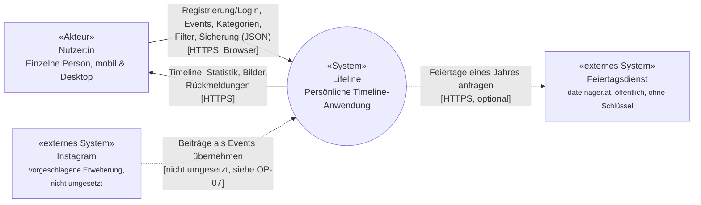

## 3. Kontextabgrenzung

### 3.1 Fachlicher Kontext

Ziel dieses Abschnitts ist die vollständige Aufzählung aller
Kommunikationspartner von Lifeline und die Richtung des Datenflusses
zwischen ihnen. Die fachliche Festlegung der Nachbarsysteme steht in
[S1](../spec/S1-nachbarsysteme.md); dieses Kapitel ordnet sie technisch ein.
Die interne Zerlegung ist bewusst **nicht** Teil dieses Kapitels, sondern
wird in Kapitel 5 (Bausteinsicht) und Kapitel 6 (Laufzeitsicht) beschrieben.

| Kommunikationspartner | Art | Status |
|---|---|---|
| Nutzer:in (über den Browser) | Verbindlich (NB-01, [S1.2](../spec/S1-nachbarsysteme.md#s12-nb-01--browser-der-nutzerin)) | Umgesetzt |
| Feiertagsdienst | Optional, nicht-blockierend (NB-02, [S1.3](../spec/S1-nachbarsysteme.md#s13-nb-02--feiertagsdienst)) | Umgesetzt |
| Instagram | Vorgeschlagene Erweiterung (NB-03, [S1.4](../spec/S1-nachbarsysteme.md#s14-nb-03--instagram-vorgeschlagene-erweiterung)) | Nicht umgesetzt, siehe [OP-07](../OFFENE-PUNKTE.md) |

Die durchgezogenen Kanten sind verbindlich: ohne sie ist Lifeline nicht
nutzbar. Die gestrichelten Kanten sind optional: Fällt der Feiertagsdienst
aus, zeigt die Timeline schlicht keine Feiertage an; eine Fehlermeldung
entsteht nicht (S1.3.2).

### 3.2 Ein- und Ausgaben im Detail

| Kommunikationspartner | Eingaben an Lifeline | Ausgaben von Lifeline |
|---|---|---|
| Nutzer:in | Zugangsdaten (Registrierung/Login); Events (Titel, Beschreibung, Datum, optionale Uhrzeit, Kategorie, Bedeutung, optionales Bild); neue Kategorien (Name, Farbe); Filterauswahl; Sicherungsdatei (JSON) für den Import | Chronologische, filterbare Timeline mit Feiertagsmarkierungen; Event-Karten mit Bildern; aggregierte Statistik; Sicherungsdatei (JSON) und PNG-Bild der Timeline als Download; Rückmeldungen (Bestätigungen, Fehlermeldungen) |
| Feiertagsdienst | Liste der gesetzlichen Feiertage eines Jahres (Datum, Name) | Anfrage mit Ländercode (`HOLIDAY_COUNTRY`, Standard `DE`) und Jahr |

### 3.3 Technischer Kontext

| Kanal | Protokoll / Format | Umsetzung |
|---|---|---|
| Browser ↔ Lifeline | HTTP(S), JSON; Bilder als Base64-Data-URI im JSON-Body; Session-Cookie `sid` | REST-API unter `/api/*`, Bilder unter `/uploads/*` (Kapitel 5.2.2, 8.2) |
| Lifeline → Feiertagsdienst | HTTPS, JSON, ohne Schlüssel | `GET https://date.nager.at/api/v3/PublicHolidays/{Jahr}/{Land}`, aufgerufen vom Backend in `routes/holidays.ts` mit 4 s Zeitlimit; das Frontend fragt nur das eigene Backend (`GET /api/holidays?year=…`) |

Das Frontend spricht den Feiertagsdienst nicht direkt an. Das Backend dient
als Vermittler: So bleibt der Browser auf eine einzige Gegenstelle
beschränkt, das Ergebnis kann pro Jahr zwischengespeichert werden, und
jeder Fehler des externen Dienstes wird an einer Stelle in eine leere Liste
umgewandelt.

Der Funktionsumfang selbst (Muss-Anwendungsfälle und Erweiterungen) ist in
[P1.4.1](../spec/P1-ziele-rahmenbedingungen.md#p141-zuordnung-der-anwendungsfälle)
festgelegt.
