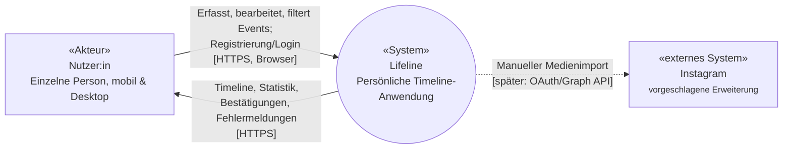

## 3. Kontextabgrenzung

### 3.1 Systemkontext

Ziel dieses Abschnitts ist die vollständige Aufzählung aller
Kommunikationspartner von Lifeline und die Richtung des Datenflusses
zwischen ihnen (vgl. Siedersleben, Kapitel 4.2). Die interne Zerlegung
(Komponenten, Schichten, Ablaufdiagramme) ist bewusst **nicht** Teil
dieses Kapitels, sondern wird in Kapitel 5 (Bausteinsicht) und Kapitel 6
(Laufzeitsicht) beschrieben.

Lifeline hat aktuell einen verbindlichen Kommunikationskanal zum Browser der
Nutzer:in [HTTPS]. Instagram ist als vorgeschlagene, noch nicht produktiv
angebundene Erweiterung dokumentiert. Für die Abgabe ist nur ein klar abgegrenzter
manueller Importprototyp vorgesehen; OAuth und die Instagram Graph API bleiben ein
späterer Ausbau.

### 3.2 Ein- und Ausgaben im Detail

| Kommunikationspartner | Eingaben an Lifeline | Ausgaben von Lifeline |
|---|---|---|
| Nutzer:in | Timeline-Einträge (Titel, Beschreibung, Datum, Uhrzeit, Kategorie), Zugangsdaten (Registrierung/Login), Aktionen (Anlegen/Bearbeiten/Löschen/Filtern) | Chronologische, filterbare Darstellung der Timeline, aggregierte Statistik, Zugriffsbestätigung nach Login, Rückmeldungen (Bestätigungen, Fehlermeldungen) |

Login, Filterung und Statistik sind gemäß P1 §6 und ADR-004/UC-05/UC-06
fester Bestandteil des Umfangs. Die interne Aufteilung in Frontend,
Backend und Datenbank ist **nicht** Teil dieses Kapitels, sondern wird
in Kapitel 5 (Bausteinsicht) beschrieben.
