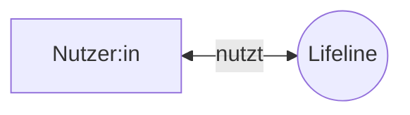

## 3. Kontextabgrenzung

### 3.1 Fachlicher Kontext

Lifeline wird hier als Ganzes (Black Box) betrachtet. In der aktuellen
Projektphase ist die Nutzerin/der Nutzer der einzige externe
Kommunikationspartner – es sind keine weiteren externen Systeme
vorgesehen (vgl. P2 §3, §8).

| Kommunikationspartner | Eingaben an Lifeline | Ausgaben von Lifeline |
|---|---|---|
| Nutzer:in | Timeline-Einträge (Titel, Beschreibung, Datum/Zeitraum), Aktionen (Anlegen/Bearbeiten/Löschen) | Chronologische Darstellung der Timeline, Rückmeldungen (Bestätigungen, Fehlermeldungen) |

### 3.2 Technischer Kontext

| Kanal | Protokoll | Übertragene Daten |
|---|---|---|
| Nutzer:in → Lifeline | HTTPS | Formulareingaben, Anfragen über den Browser |
| Lifeline → Nutzer:in | HTTPS | Gerenderte Timeline-Ansicht, Antworten auf Anfragen |

Die fachlichen Ein-/Ausgaben aus 3.1 laufen vollständig über diesen einen
Kanal, da aktuell kein weiteres externes System angebunden ist. Die
interne Aufteilung in Frontend, Backend und Datenbank ist **nicht** Teil
dieses Kapitels, sondern wird in Kapitel 5 (Bausteinsicht) beschrieben.
