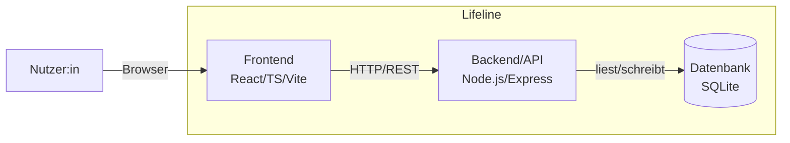

## 5. Bausteinsicht

### 5.1 Whitebox Gesamtsystem

**Begründung der Zerlegung:** Die Dreiteilung Frontend/Backend/Datenbank
folgt direkt der in Kapitel 4 festgelegten Lösungsstrategie und trennt
Darstellung, Anwendungslogik und Datenhaltung sauber voneinander
(Nachvollziehbarkeit, QG-02).

| Baustein | Verantwortlichkeit | Code-Ort |
|---|---|---|
| **Frontend** | Darstellung der Timeline, Formulare, Filter und Statistik im Browser; sendet Anfragen an das Backend | `frontend/` |
| **Backend/API** | Verarbeitet Anfragen, validiert Eingaben, greift auf die Datenbank zu, stellt REST-Endpunkte bereit | `backend/` |
| **Datenbank** | Dauerhafte Speicherung aller Timeline-Einträge und Nutzerdaten | SQLite-Datei |

### 5.2 Level 2

Gemäß arc42-Empfehlung ("Refine only a few building blocks") werden nur
Frontend und Backend verfeinert, da hier die eigentliche fachliche Logik
liegt. Die Datenbank ist bereits selbsterklärend (Schema siehe Spec D1/D2)
und wird nicht weiter zerlegt.

#### 5.2.1 Whitebox Frontend

| Baustein | Verantwortlichkeit | Erfüllt Use Case |
|---|---|---|
| `TimelineView` | Chronologische Darstellung aller Events, Zoom/Scroll | UC-04 |
| `EventForm` | Formular zum Anlegen/Bearbeiten eines Events | UC-01, UC-02 |
| `FilterBar` | Filterung der Timeline nach Kategorie | UC-05 |
| `StatsDashboard` | Aggregierte Auswertung (Zeit gearbeitet vs. gereist) | UC-06 |
| `AuthForms` | Login- und Registrierungsformulare | UC-07 |
| `ApiClient` | Zentrale Schnittstelle für alle HTTP-Anfragen ans Backend | — |

#### 5.2.2 Whitebox Backend/API

| Baustein | Verantwortlichkeit | Erfüllt Use Case |
|---|---|---|
| `routes/events` | REST-Endpunkte für Anlegen/Bearbeiten/Löschen/Abrufen von Events | UC-01, UC-02, UC-03, UC-04 |
| `routes/auth` | Endpunkte für Registrierung und Login | UC-07 |
| `routes/stats` | REST-Endpunkt zur Auslieferung der aggregierten Statistik | UC-06 |
| `services/statsService` | Berechnet aggregierte Zeiträume je Kategorie | UC-06 |
| `models/` | Datenzugriffsschicht (Zugriff auf SQLite) | — |
| `middleware/validation` | Prüft eingehende Daten vor der Verarbeitung | alle UCs |
