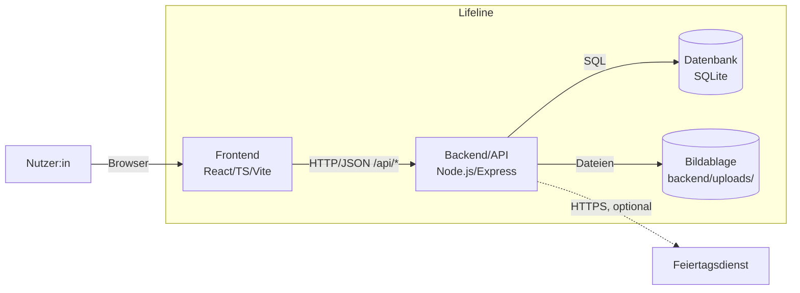
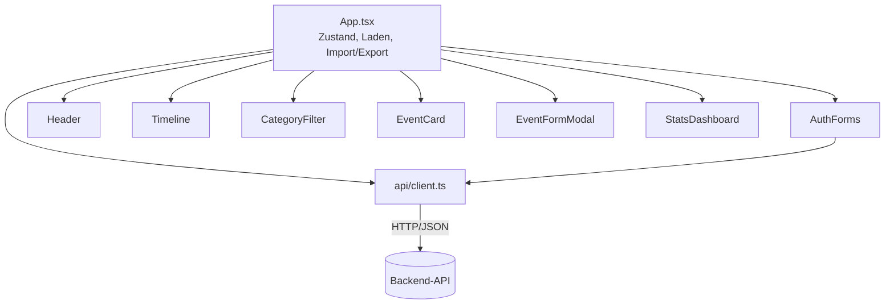
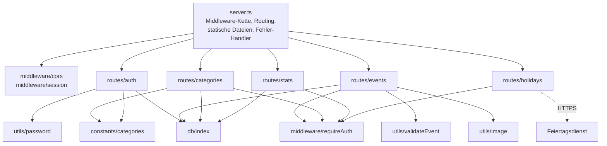

## 5. Bausteinsicht

### 5.1 Whitebox Gesamtsystem

**Begründung der Zerlegung:** Die Dreiteilung Frontend/Backend/Datenhaltung
folgt der Lösungsstrategie (Kapitel 4) und trennt Darstellung, Anwendungslogik
und Datenhaltung (Nachvollziehbarkeit, QG-02). Bilder liegen bewusst als
Dateien neben der Datenbank und nicht als BLOB in SQLite
([D2.3](../spec/D2-datentypenverzeichnis.md#d23-bild-image_path), Kapitel 8.3).

#### Blackbox Frontend

| Merkmal | Beschreibung |
|---|---|
| Zweck/Verantwortung | Darstellung von Anmeldung, Timeline, Event-Formular, Filter, Statistik; clientseitige Filterung, PNG-Export und JSON-Sicherung |
| Schnittstelle(n) | HTTP/JSON an die Backend-API, gebündelt in `api/client.ts` |
| Ablageort | `frontend/src/` |

#### Blackbox Backend/API

| Merkmal | Beschreibung |
|---|---|
| Zweck/Verantwortung | Authentifizierung und Sessions, Validierung, Zugriffsschutz, Datenhaltung, Bildablage, Statistik, Vermittlung des Feiertagsdienstes; liefert im Produktionsbetrieb auch das gebaute Frontend aus |
| Schnittstelle(n) | REST-API unter `/api/*` (JSON), statische Bilder unter `/uploads/*`; SQL zur Datenbank; HTTPS zum Feiertagsdienst |
| Ablageort | `backend/src/` |

#### Blackbox Datenbank

| Merkmal | Beschreibung |
|---|---|
| Zweck/Verantwortung | Dauerhafte Speicherung von `users`, `categories` und `events` ([D1](../spec/D1-datenmodell.md)) |
| Schnittstelle(n) | SQL über das eingebaute Modul `node:sqlite`, ausschließlich durch das Backend |
| Ablageort | SQLite-Datei, Standard `backend/data/lifeline.db` (`DATABASE_PATH`) |

#### Blackbox Bildablage

| Merkmal | Beschreibung |
|---|---|
| Zweck/Verantwortung | Speicherung der zu Events hochgeladenen Bilder; in der Datenbank steht nur der Pfad (`image_path`) |
| Schnittstelle(n) | Dateisystem; Auslieferung über `/uploads/<Dateiname>` |
| Ablageort | `backend/uploads/` |

### 5.2 Level 2 – Whitebox-Zerlegung

Frontend und Backend werden verfeinert, weil dort die fachliche Logik liegt.
Datenbank und Bildablage sind durch [D1](../spec/D1-datenmodell.md) und
[D2](../spec/D2-datentypenverzeichnis.md) ausreichend beschrieben. Die
Bausteinnamen entsprechen den Dateinamen im Code.

#### 5.2.1 Whitebox Frontend

| Baustein | Zweck/Verantwortung | Erfüllt | Dialog (B1) | Ablageort |
|---|---|---|---|---|
| `App` | Wurzelkomponente: hält Session, Events, Kategorien und Filter; lädt Daten; führt JSON-Export/-Import, PNG-Export und „Alle löschen“ aus; führt bei abgelaufener Session zum Login zurück | UC-04, UC-09, UC-10 | DLG-01 | `frontend/src/App.tsx` |
| `AuthForms` | Anmelde- und Registrierungsformular inkl. Passwortbestätigung | UC-07 | DLG-05 | `frontend/src/components/AuthForms.tsx` |
| `Header` | Anwendungsrahmen: angemeldete Person, „Ereignis hinzufügen“, Menü für Export, Import, „Alle löschen“ und Abmelden | UC-07 (Abmelden), UC-09, UC-10 | B1.4.5 | `frontend/src/components/Header.tsx` |
| `Timeline` | Chronologische Darstellung in Übersicht und Jahresansicht mit fließendem Übergang (alle Events bleiben gerendert und gleiten an ihre neue Position), Zoom, Feiertagsmarkierungen, Markergröße nach Bedeutung, Verteilung der Beschriftungen auf vier Ebenen | UC-04 | DLG-01 | `frontend/src/components/Timeline.tsx` |
| `EventCard` | Karte eines Events mit Details, Bild, Bearbeiten und Löschen | UC-02, UC-03, UC-04 | DLG-01 | `frontend/src/components/EventCard.tsx` |
| `EventFormModal` | Formular zum Anlegen und Bearbeiten eines Events inkl. Bildauswahl mit Vorschau | UC-01, UC-02 | DLG-02 | `frontend/src/components/EventFormModal.tsx` |
| `CategoryFilter` | Filterleiste nach Kategorie (AF-03) und Anlegen einer neuen Kategorie | UC-05, UC-08 | DLG-03, DLG-06 | `frontend/src/components/CategoryFilter.tsx` |
| `StatsDashboard` | Anzeige der Kennzahlen aus `GET /api/stats`: Kacheln, Ringdiagramm der Anteile je Kategorie (eigenes SVG ohne Diagramm-Bibliothek, Teilkomponente `CategoryDonut`) und Tabelle als Legende und Textfassung | UC-06 | DLG-04 | `frontend/src/components/StatsDashboard.tsx` |
| `api/client` | Einzige Stelle für HTTP-Anfragen; wandelt Backend-Zeilen in Frontend-Typen um; meldet 401 an `App` | alle | — | `frontend/src/api/client.ts` |
| `types` | Frontend-Datentypen `LifeEvent`, `Category`, `Holiday` (Abbildung auf D1 siehe Kapitel 8.4) | — | — | `frontend/src/types.ts` |

Die Filterung (AF-03) und der PNG-Export (AF-04) laufen vollständig im
Frontend; es gibt dafür keinen Backend-Baustein.

#### 5.2.2 Whitebox Backend/API

| Baustein | Zweck/Verantwortung | Schnittstelle | Erfüllt | Ablageort |
|---|---|---|---|---|
| `server` | Einstiegspunkt: wendet Schema und Migrationen an, registriert Middleware und Routen, liefert `/uploads` und im Produktionsbetrieb das gebaute Frontend aus, zentraler Fehler-Handler; `GET /api/health` meldet `{ status: "ok" }`, sobald die Datenbank antwortet (ohne Session, ohne Nutzdaten) | HTTP | — | `backend/src/server.ts` |
| `middleware/cors` | Erlaubt dem Frontend auf anderem Port Anfragen mit Cookie (`FRONTEND_ORIGIN`) | Express-Middleware | — | `backend/src/middleware/cors.ts` |
| `middleware/session` | In-Memory-Session-Store, Setzen und Löschen des Cookies `sid`, Ermitteln von `req.userId` | Express-Middleware | UC-07 | `backend/src/middleware/session.ts` |
| `middleware/requireAuth` | Weist Anfragen ohne gültige Session mit 401 ab | Express-Middleware | alle außer UC-07 | `backend/src/middleware/requireAuth.ts` |
| `routes/auth` | `POST /register`, `POST /login`, `POST /logout`, `GET /me`; legt bei der Registrierung die Startkategorien an | `/api/auth/*` | UC-07 | `backend/src/routes/auth.ts` |
| `routes/events` | `GET`, `POST`, `PUT`, `DELETE` auf eigene Events inkl. Bild; prüft Besitz und Kategorie | `/api/events[/:id]` | UC-01–UC-04 | `backend/src/routes/events.ts` |
| `routes/categories` | `GET` und `POST` auf eigene Kategorien | `/api/categories` | UC-08 | `backend/src/routes/categories.ts` |
| `routes/stats` | Aggregation per SQL: Anzahl, ältestes/jüngstes Datum, Zeitspanne (AF-01), Anzahl und Mittel der Bedeutung je Kategorie (AF-02) | `/api/stats` | UC-06 | `backend/src/routes/stats.ts` |
| `routes/holidays` | Vermittelt den Feiertagsdienst (NB-02), Zwischenspeicher je Land und Jahr, liefert bei jedem Fehler eine leere Liste | `/api/holidays?year=` | UC-04 (Schritt 4) | `backend/src/routes/holidays.ts` |
| `utils/validateEvent` | Zentrale Prüfung der Event-Eingaben für `POST` und `PUT` | Funktionsaufruf | UC-01, UC-02 | `backend/src/utils/validateEvent.ts` |
| `utils/image` | Prüft Data-URI, Format, Größe und Dateisignatur; speichert und löscht Bilddateien | Funktionsaufruf | UC-01–UC-03 | `backend/src/utils/image.ts` |
| `utils/password` | Hashen und Prüfen von Passwörtern mit `scrypt` | Funktionsaufruf | UC-07 | `backend/src/utils/password.ts` |
| `constants/categories` | Startkategorien sowie Prüfregeln für Name und Farbe | Konstanten, Funktionen | UC-07, UC-08 | `backend/src/constants/categories.ts` |
| `db/index` | Zentrale SQLite-Verbindung (`DATABASE_PATH`), Anwenden von `schema.sql` | Modul-Export `db` | — | `backend/src/db/index.ts`, `backend/src/db/schema.sql` |
| `db/migrateCategories` | Einmalige Umstellung älterer Datenbestände auf die Entität `categories` beim Start | Funktionsaufruf | — | `backend/src/db/migrateCategories.ts`, `backend/src/db/migrate.ts` |

Eine eigene Datenzugriffsschicht (Repositories/Models) gibt es bewusst nicht:
Die Routen greifen direkt über `db/index` auf die Datenbank zu. Bei vier
Tabellenoperationen je Route wäre eine zusätzliche Schicht mehr Aufwand als
Nutzen; jede Abfrage enthält die Einschränkung auf `user_id` (Kapitel 8.2).

### 5.3 Rückverfolgbarkeit Anwendungsfall → Baustein

| Anwendungsfall | Frontend | Backend | Laufzeitsicht |
|---|---|---|---|
| UC-01 Event anlegen | `EventFormModal`, `App` | `routes/events`, `utils/validateEvent`, `utils/image` | 6.1 |
| UC-02 Event bearbeiten | `EventCard`, `EventFormModal` | `routes/events`, `utils/validateEvent`, `utils/image` | wie 6.1 |
| UC-03 Event löschen | `EventCard`, `App` | `routes/events`, `utils/image` | wie 6.1 |
| UC-04 Timeline ansehen | `App`, `Timeline`, `EventCard` | `routes/events`, `routes/holidays` | 6.4 |
| UC-05 Timeline filtern | `CategoryFilter`, `App` | — (clientseitig) | — |
| UC-06 Statistik berechnen | `StatsDashboard` | `routes/stats` | 6.3 |
| UC-07 Registrieren und Login (inkl. Abmelden) | `AuthForms`, `Header` | `routes/auth`, `middleware/session`, `utils/password` | 6.2 |
| UC-08 Kategorie anlegen | `CategoryFilter` | `routes/categories`, `constants/categories` | 6.5 |
| UC-09 Sicherung exportieren | `Header`, `App` | — (clientseitig) | — |
| UC-10 Sicherung importieren | `Header`, `App` | `routes/categories`, `routes/events` | — |
