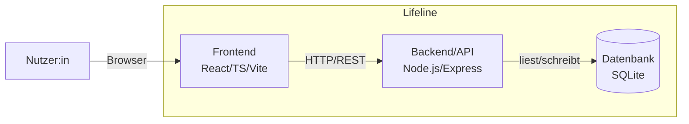

## 5. Bausteinsicht

### 5.1 Whitebox Gesamtsystem

**Begründung der Zerlegung:** Die Dreiteilung Frontend/Backend/Datenbank
folgt direkt der in Kapitel 4 festgelegten Lösungsstrategie und trennt
Darstellung, Anwendungslogik und Datenhaltung sauber voneinander
(Nachvollziehbarkeit, QG-02).

Lifeline enthält auf dieser Ebene genau drei Bausteine, die im Folgenden
jeweils als Blackbox beschrieben werden (Verantwortung und Schnittstelle
nach außen, ohne interne Details).

#### Blackbox Frontend

| Merkmal | Beschreibung |
|---|---|
| Zweck/Verantwortung | Darstellung der Timeline, Formulare, Filter und Statistik im Browser; sendet Anfragen an das Backend |
| Schnittstelle(n) | HTTP/REST-Aufrufe an die Backend-API (gebündelt über `ApiClient`) |
| Ablageort | `frontend/` |

#### Blackbox Backend/API

| Merkmal | Beschreibung |
|---|---|
| Zweck/Verantwortung | Verarbeitet vom Frontend gesendete Anfragen, validiert Eingaben, greift auf die Datenbank zu, stellt REST-Endpunkte bereit |
| Schnittstelle(n) | REST-API (HTTP/JSON) für das Frontend; SQL-Zugriff auf die Datenbank |
| Ablageort | `backend/` |

#### Blackbox Datenbank

| Merkmal | Beschreibung |
|---|---|
| Zweck/Verantwortung | Dauerhafte Speicherung aller Timeline-Einträge und Nutzerdaten |
| Schnittstelle(n) | SQL, ausschließlich durch das Backend angesprochen (kein direkter Zugriff durch das Frontend, siehe 8.2) |
| Ablageort | SQLite-Datei (`backend/data/lifeline.db`) |

### 5.2 Level 2 – Whitebox-Zerlegung

Gemäß arc42-Empfehlung ("Refine only a few building blocks") werden nur
Frontend und Backend verfeinert, da hier die eigentliche fachliche Logik
liegt. Die Datenbank ist bereits selbsterklärend (Schema siehe Spec D1/D2)
und wird nicht weiter zerlegt.

#### 5.2.1 Whitebox Frontend

Der Baustein Frontend zerfällt in folgende Blackboxen:

| Baustein | Zweck/Verantwortung (Blackbox) | Schnittstelle | Erfüllt Use Case | Ablageort |
|---|---|---|---|---|
| `TimelineView` | Chronologische Darstellung aller Events, Zoom/Scroll | Erhält Events von `ApiClient`, rendert sie | UC-04 | `frontend/src/components/Timeline.tsx` |
| `EventForm` | Formular zum Anlegen/Bearbeiten eines Events | Ruft `ApiClient` mit Formulardaten auf | UC-01, UC-02 | `frontend/src/components/EventFormModal.tsx` |
| `FilterBar` | Filterung der Timeline nach Kategorie | Reicht gewählte Kategorie an `TimelineView` weiter | UC-05 | `frontend/src/components/CategoryFilter.tsx` |
| `StatsDashboard` | Aggregierte Auswertung je Kategorie | Ruft `ApiClient` auf, rendert Ergebnis | UC-06 | *noch nicht umgesetzt* |
| `AuthForms` | Login- und Registrierungsformulare | Ruft `ApiClient` mit Zugangsdaten auf | UC-07 | `frontend/src/components/AuthForms.tsx` |
| `ApiClient` | Zentrale Schnittstelle für alle HTTP-Anfragen ans Backend | HTTP/REST zum Backend | — | `frontend/src/api/client.ts` |

**Hinweis:** `AuthForms` ist umgesetzt und verwendet die Registrierungs- und
Login-Endpunkte. `StatsDashboard` ist weiterhin eine geplante Erweiterung;
der Statistik-Endpunkt existiert nur im Backend.

#### 5.2.2 Whitebox Backend/API

Der Baustein Backend/API zerfällt in folgende Blackboxen:

| Baustein | Zweck/Verantwortung (Blackbox) | Schnittstelle | Erfüllt Use Case | Ablageort |
|---|---|---|---|---|
| `routes/events` | REST-Endpunkte für Anlegen/Bearbeiten/Löschen/Abrufen von Events | HTTP (REST) vom Frontend; greift direkt auf die Datenbank zu | UC-01, UC-02, UC-03, UC-04 | `backend/src/routes/events.ts` |
| `routes/auth` | Endpunkte für Registrierung und Login | HTTP (REST) vom Frontend; greift direkt auf die Datenbank zu | UC-07 | `backend/src/routes/auth.ts` |
| `routes/stats` | REST-Endpunkt zur Auslieferung der aggregierten Statistik | HTTP (REST) vom Frontend; greift direkt auf die Datenbank zu | UC-06 | `backend/src/routes/stats.ts` |
| `middleware/validation` | Prüft eingehende Daten vor der Verarbeitung | Wird von den Routes vor der Verarbeitung aufgerufen | alle UCs | `backend/src/utils/validateEvent.ts` |
| Datenbankverbindung | Zentrale SQLite-Verbindung inkl. Schema-Anwendung | Wird von den Routes direkt angesprochen | — | `backend/src/db/index.ts` |

**Hinweis:** Eine eigene Datenzugriffsschicht (`models/`) sowie ein
ausgelagerter `services/statsService` waren ursprünglich vorgesehen,
sind im aktuellen Code aber nicht als eigene Module umgesetzt – die
Routes (`routes/events`, `routes/auth`, `routes/stats`) greifen
stattdessen direkt auf die zentrale Datenbankverbindung zu. Diese
Tabelle wurde entsprechend an den tatsächlichen Code angepasst.
