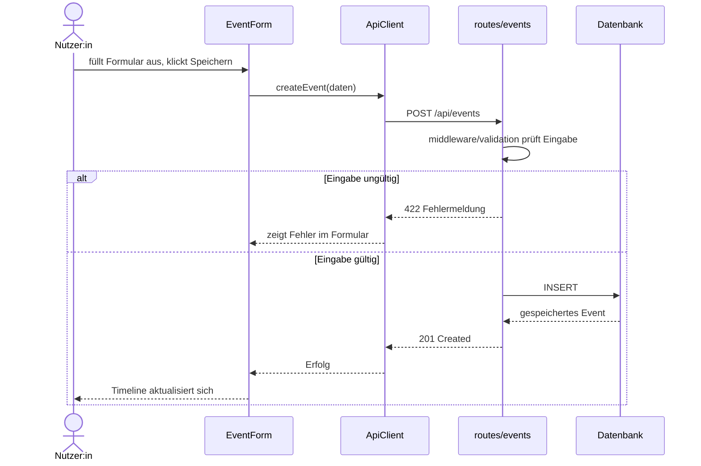
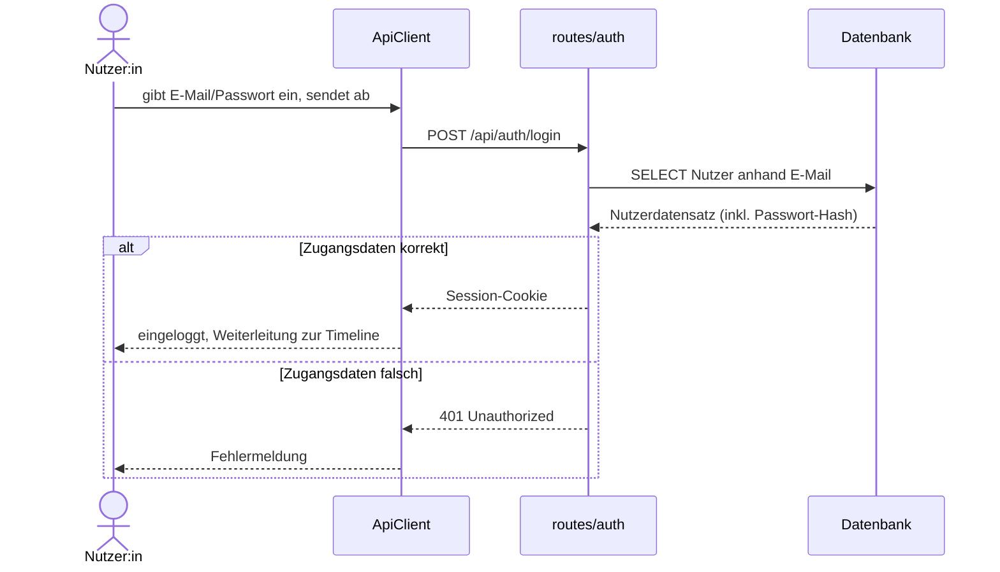
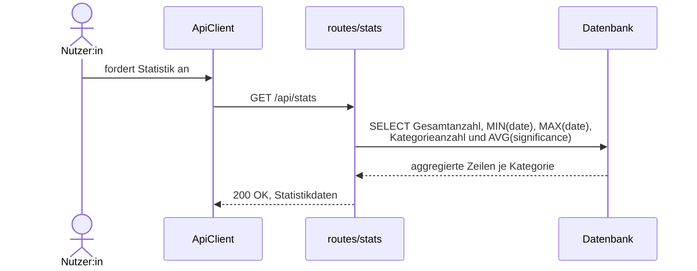

## 6. Laufzeitsicht

Auswahlkriterium nach arc42: architektonische Relevanz, nicht
Vollständigkeit. Reine CRUD-Abläufe (Event bearbeiten, löschen,
Timeline anzeigen) folgen alle demselben einfachen
Frontend-Backend-Datenbank-Muster wie 6.1 und werden daher nicht
einzeln diagrammiert.

| Szenario | Use Case | Warum architektonisch relevant |
|---|---|---|
| 6.1 Event anlegen | UC-01 | Repräsentativ für alle CRUD-Abläufe; zeigt Validierungsmuster |
| 6.2 Registrieren & Login | UC-07 | Einzige Zugriffskontrolle im System |
| 6.3 Statistik berechnen | UC-06 | Einzige echte Aggregations-/Business-Logik |

Alle in den folgenden Diagrammen verwendeten Bausteine sind in Kapitel 5
(Bausteinsicht) als Blackbox beschrieben.

### 6.1 Event anlegen

**Anmerkungen:** Die Validierung (`middleware/validation`) wird direkt
innerhalb der Route aufgerufen, bevor gespeichert wird – damit bleiben
die Daten auch bei direkten API-Aufrufen konsistent (Nachvollziehbarkeit,
QG-02). Es gibt keine separate Datenzugriffsschicht; `routes/events`
spricht die Datenbankverbindung direkt an (siehe 5.2.2). Dieses Muster
gilt analog für UC-02 (Bearbeiten) und UC-03 (Löschen).

### 6.2 Registrieren & Login

**Auth-Mechanismus:** Session-basierte Authentifizierung – Kontext,
Alternativen und Begründung siehe ADR-004 (Kapitel 9). Konkrete
Realisierung (Passwort-Hashing, Cookie-Flags, Session-Store) siehe
Kapitel 8.2. `AuthForms` ist als eigener Frontend-Baustein umgesetzt und
ruft die Registrierungs- und Login-Endpunkte über `ApiClient` auf.

### 6.3 Statistik berechnen

**Anmerkung:** Die Aggregation erfolgt direkt in `routes/stats`, nicht über
einen separaten `statsService`. `StatsDashboard` ruft den Endpunkt über den
`ApiClient` auf und zeigt Gesamtanzahl, Zeitspanne und Kategorieaggregation an.

**Bewusst nicht diagrammiert:** UC-04 (Timeline ansehen, einfaches GET)
und UC-05 (Filtern) – Filterung findet clientseitig auf bereits
geladenen Daten statt, ohne zusätzlichen Server-Roundtrip.
