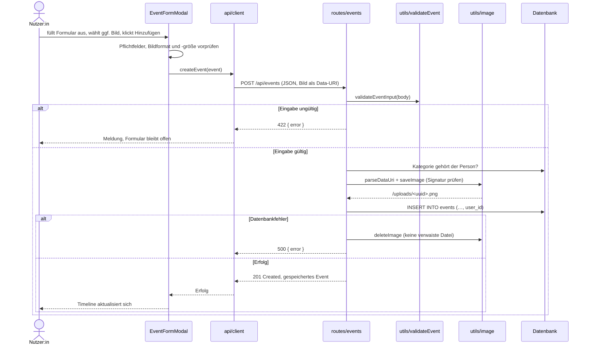
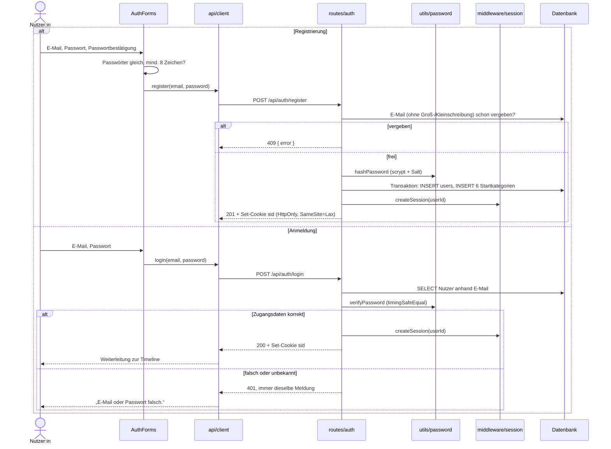
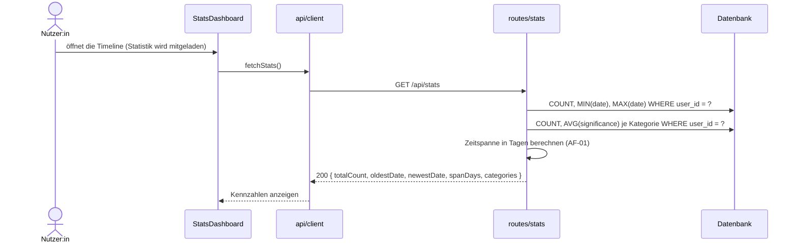
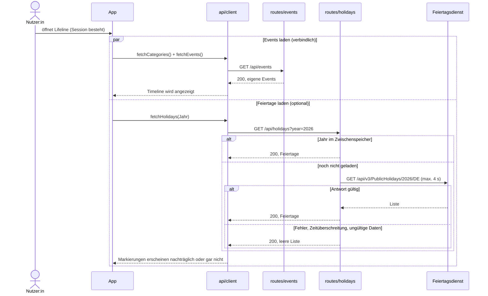
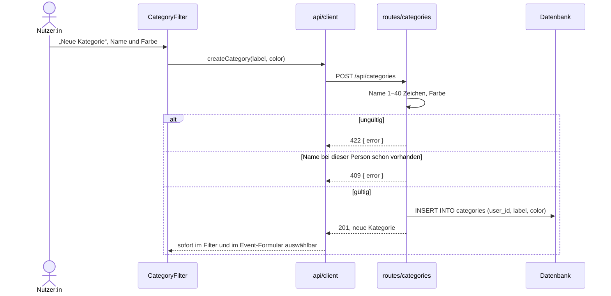
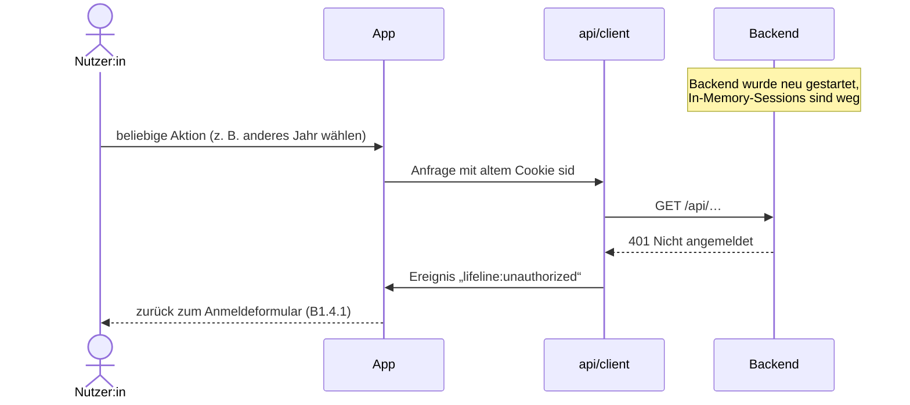

## 6. Laufzeitsicht

Auswahlkriterium nach arc42: architektonische Relevanz, nicht
Vollständigkeit. Bearbeiten und Löschen eines Events folgen demselben
Muster wie 6.1 und werden nicht eigens diagrammiert.

| Szenario | Anwendungsfall | Warum architektonisch relevant |
|---|---|---|
| 6.1 Event anlegen | UC-01 | Repräsentativ für alle schreibenden Abläufe; zeigt Validierung, Besitzprüfung und Bildablage |
| 6.2 Registrieren und Login | UC-07 | Einzige Zugangskontrolle; zeigt Transaktion, Passwort-Hash und Session |
| 6.3 Statistik berechnen | UC-06 | Einzige Aggregation auf dem Server |
| 6.4 Timeline ansehen mit Feiertagen | UC-04 | Zeigt das nicht-blockierende Nachbarsystem NB-02 |
| 6.5 Kategorie anlegen | UC-08 | Laufzeit-Erweiterbarkeit der Kategorien (NFR-14c-01) |
| 6.6 Abgelaufene Session | alle außer UC-07 | Verhalten nach Serverneustart (In-Memory-Sessions, Kapitel 8.2) |

Alle Bausteine in den Diagrammen sind in Kapitel 5 beschrieben.

### 6.1 Event anlegen

**Anmerkungen:** Die verbindliche Prüfung liegt im Backend; die Vorprüfung im
Formular dient nur der schnellen Rückmeldung am Feld (Kapitel 8.1). Beim
Bearbeiten (`PUT`) wird ein ersetztes Bild erst **nach** erfolgreichem Update
gelöscht, damit ein Datenbankfehler keinen Verweis auf eine fehlende Datei
hinterlässt ([NFR-12d-02](../spec/N1-nichtfunktional.md), OP-08).

### 6.2 Registrieren und Login

**Auth-Mechanismus:** Session-basierte Authentifizierung, Begründung in ADR-004
(Kapitel 9), technische Details in Kapitel 8.2. Die gleiche Meldung für
unbekannte Adresse und falsches Passwort verhindert, dass registrierte
Adressen ermittelt werden können (B1 DLG-05).

### 6.3 Statistik berechnen

**Anmerkung:** Die Aggregation (AF-02) erfolgt per SQL direkt in
`routes/stats`. Nach jedem Anlegen, Bearbeiten, Löschen und Import lädt das
Frontend die Statistik neu. Ein aktiver Kategoriefilter wirkt nicht auf die
Statistik; das `StatsDashboard` weist darauf hin (B1 DLG-04).

### 6.4 Timeline ansehen mit Feiertagen

**Anmerkung:** Beide Anfragen laufen unabhängig voneinander. Die Timeline
wartet nicht auf die Feiertage, und kein Fehler des Feiertagsdienstes erreicht
die Oberfläche ([S1.3.2](../spec/S1-nachbarsysteme.md#s132-bindende-regel-fehlerverhalten)).
`fetchHolidays` wirft deshalb bewusst nie eine Ausnahme. Die Filterung (UC-05)
ist nicht diagrammiert: Sie arbeitet ohne Serveranfrage auf den bereits
geladenen Events.

### 6.5 Kategorie anlegen

### 6.6 Abgelaufene Session

**Anmerkung:** Die gespeicherten Daten bleiben erhalten; nur die Anmeldung
muss wiederholt werden (Kapitel 8.2, SC-04).
