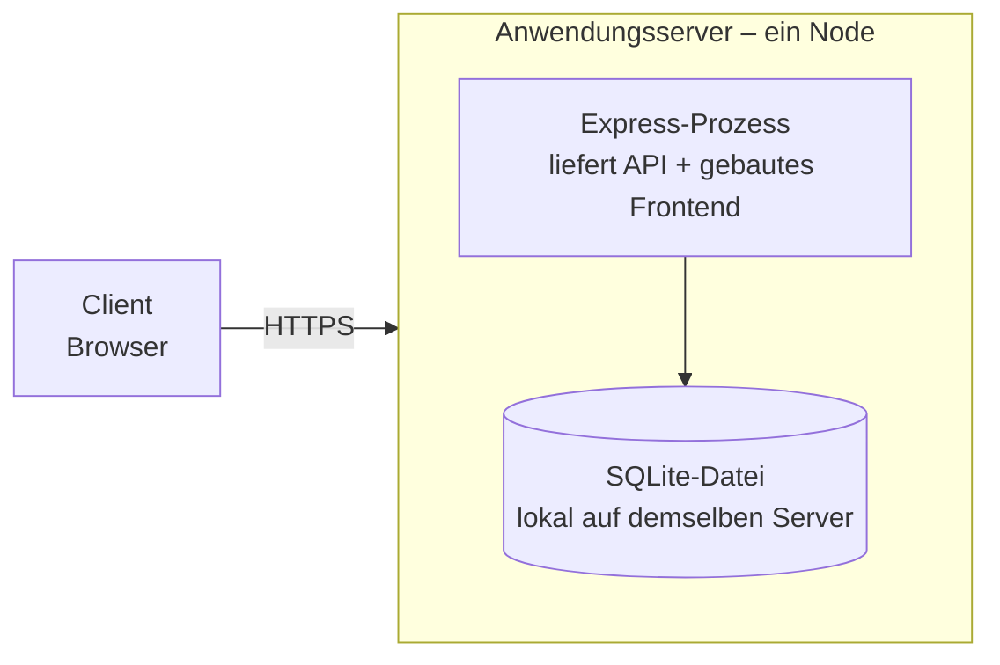

## 7. Verteilungssicht

### 7.1 Infrastruktur Ebene 1

#### 7.1.1 Entwicklungsumgebung

| Element | Realisierung |
|---|---|
| Frontend | `npm run dev` (Vite Dev-Server mit Hot-Reload), lokal im Browser |
| Backend | `npm run dev` (Node.js-Prozess), lokaler Port |
| Datenbank | SQLite-Datei lokal im Projektverzeichnis |
| Voraussetzung | Node.js lokal installiert (kein Docker nötig, da Node plattformübergreifend direkt läuft) |

#### 7.1.2 Zielumgebung (Produktion/Demo)

| Baustein (aus Kap. 5) | Läuft auf |
|---|---|
| Frontend (gebaut) | wird vom Express-Prozess als statische Dateien ausgeliefert |
| Backend/API | Node.js-Prozess auf dem Anwendungsserver |
| Datenbank | SQLite-Datei im lokalen Dateisystem desselben Servers |

**Begründung:** Ein einziges Deployable statt getrennter Server für
Frontend/Backend/Datenbank – passend zum Projektumfang (4-Personen-Team,
begrenzte Zeit, Prototyp-Charakter laut P1 §3) und ohne Mehraufwand für
Netzwerk-Konfiguration zwischen mehreren Diensten.

**Abgelehnte Alternativen:**
- Getrennte Server für Frontend (z. B. Vercel) und Backend (z. B. Railway) –
  mehr Betriebsaufwand für zwei Deployments, für einen Prototyp nicht
  gerechtfertigt
- Separater Datenbankserver (z. B. PostgreSQL) – Overhead steht in keinem
  Verhältnis zum Datenvolumen eines Einzelnutzer-Prototyps (vgl. P1 §8.1,
  4-Personen-Team ohne Produktivbetrieb-Anspruch)

### 7.2 Laufzeitkonfiguration

| Einstellung | Zweck | Wo hinterlegt |
|---|---|---|
| `PORT` | Port, auf dem der Express-Server lauscht | `.env` (nicht im Repo) |
| `DATABASE_PATH` | Pfad zur SQLite-Datei | `.env` (nicht im Repo) |
| `SESSION_SECRET` | Signierschlüssel für Sessions (siehe Kap. 8.3) | `.env` (nicht im Repo) |
| `NODE_ENV` | `development` oder `production` | `.env` bzw. Hosting-Plattform |

Konkrete Werte werden **nie** committet – nur die Variablennamen hier,
die echten Werte liegen ausschließlich lokal bzw. beim Hosting-Anbieter
(vgl. `.gitignore`-Regel aus Kapitel 2).