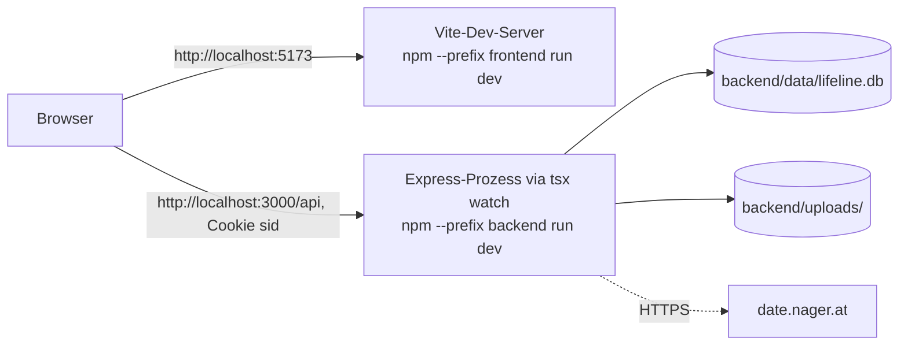
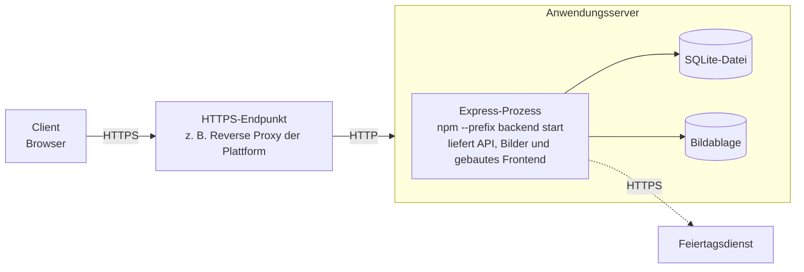

## 7. Verteilungssicht

### 7.1 Infrastruktur Ebene 1

#### 7.1.1 Entwicklungsumgebung

| Element | Realisierung |
|---|---|
| Frontend | Vite-Dev-Server mit Hot-Reload auf Port 5173 |
| Backend | Node.js-Prozess mit `tsx watch` auf Port 3000 (`PORT`) |
| Datenbank | SQLite-Datei `backend/data/lifeline.db` (`DATABASE_PATH`) |
| Bildablage | `backend/uploads/` |
| Voraussetzung | Node.js 22.13 oder neuer (wegen des eingebauten Moduls `node:sqlite`); kein Docker und kein Datenbankserver nötig |

Frontend und Backend laufen hier auf verschiedenen Ports, also als
verschiedene *Origins*. Damit das Session-Cookie trotzdem mitgesendet wird,
erlaubt das Backend genau die in `FRONTEND_ORIGIN` eingetragene Adresse mit
`Access-Control-Allow-Credentials: true` (Kapitel 8.2).

#### 7.1.2 Produktionsbetrieb (ein Prozess)

| Baustein (aus Kap. 5) | Läuft auf |
|---|---|
| Frontend (gebaut) | statische Dateien aus `frontend/dist/`, ausgeliefert vom Express-Prozess (`server.ts`) |
| Backend/API | ein Node.js-Prozess (`node backend/dist/server.js`) |
| Datenbank | SQLite-Datei auf dem persistenten Speicher desselben Servers |
| Bildablage | Ordner `backend/uploads/` auf dem persistenten Speicher desselben Servers |

**Build und Start** (Befehle auch in der [README](../../README.md#produktionsbetrieb-ein-prozess)):

1. `VITE_API_URL= npm --prefix frontend run build` baut das Frontend nach
   `frontend/dist/`. `VITE_API_URL` bleibt leer, damit die API unter derselben
   Adresse angesprochen wird.
2. `npm --prefix backend run build` übersetzt das Backend nach `backend/dist/`
   und kopiert `schema.sql` mit (`scripts/copy-schema.mjs`).
3. `npm --prefix backend run migrate` legt das Schema an bzw. führt die
   Datenmigration aus (geschieht zusätzlich bei jedem Start).
4. `NODE_ENV=production npm --prefix backend start` startet den Prozess. In
   diesem Modus wird das Session-Cookie nur über HTTPS gesendet (`Secure`).

**Begründung:** Ein einziges Deployable statt getrennter Server für
Frontend, Backend und Datenbank ([CON-3a-03](../spec/P1-constraints.md#con-3a-03-ein-gemeinsames-deployment)):
passend zum Projektumfang (vier Personen, feste Abgabefrist, kein Budget) und
ohne Netzwerkkonfiguration zwischen mehreren Diensten. Im Produktionsbetrieb
entfällt außerdem das Cross-Origin-Thema, weil Frontend und API unter derselben
Adresse liegen.

**Abgelehnte Alternativen:**
- Getrennte Hosting-Dienste für Frontend (z. B. Vercel) und Backend (z. B.
  Railway): zwei Deployments, Cross-Origin-Cookies auch im Betrieb; für einen
  Prototyp nicht gerechtfertigt.
- Separater Datenbankserver (z. B. PostgreSQL): siehe ADR-003.

**Anforderungen an die Zielplattform** (aus [S3.2](../betrieb/S3-inbetriebnahme.md)):
HTTPS an der öffentlichen Kante (HOST-01), ein langlaufender Node.js-Prozess
(HOST-02) und **persistenter Speicher** für `backend/data/` und
`backend/uploads/` (HOST-03). Auf Plattformen mit flüchtigem Dateisystem
gingen sonst Datenbank und Bilder bei jedem Neu-Deployment verloren
(ADR-003, Konsequenzen).

### 7.2 Laufzeitkonfiguration

| Variable | Zweck | Standard | Wo hinterlegt |
|---|---|---|---|
| `PORT` | Port, auf dem der Express-Server lauscht | `3000` | `backend/.env` bzw. Plattform |
| `DATABASE_PATH` | Pfad zur SQLite-Datei; muss auf persistenten Speicher zeigen | `./data/lifeline.db` | `backend/.env` bzw. Plattform |
| `NODE_ENV` | `development` oder `production`; in `production` wird das Cookie mit `Secure` gesetzt | – | `backend/.env` bzw. Plattform |
| `FRONTEND_ORIGIN` | Erlaubte Frontend-Adresse(n) für CORS mit Cookies, kommagetrennt; nur bei getrenntem Frontend nötig | `http://localhost:5173` | `backend/.env` |
| `HOLIDAY_COUNTRY` | Ländercode für den Feiertagsdienst | `DE` | `backend/.env` |
| `VITE_API_URL` | Adresse der API aus Sicht des Frontends; wird beim Build eingesetzt, im Produktionsbetrieb leer | `http://localhost:3000` | `frontend/.env` |

Vorlagen liegen in `backend/.env.example` und `frontend/.env.example`. Echte
`.env`-Dateien werden nicht committet (CONV-05).

Der Ablageort der Bilder ist fest `backend/uploads/` und nicht über eine
Variable einstellbar. Auf einer Zielplattform muss deshalb dieser Ordner (bzw.
der gesamte `backend/`-Ordner) auf dem persistenten Speicher liegen.
