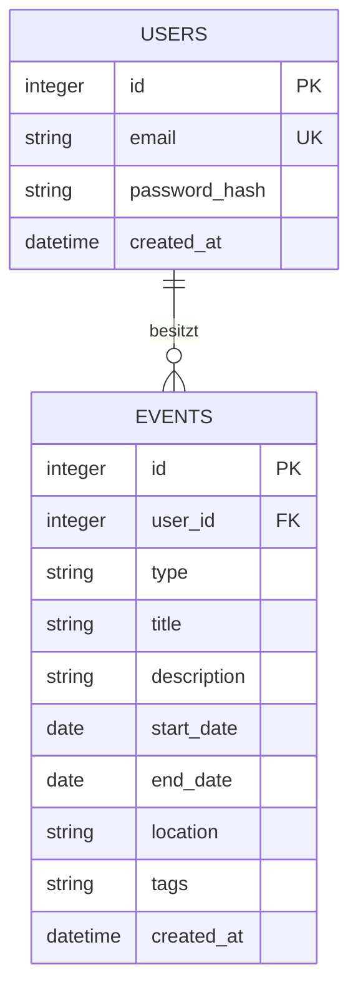

## 8. Querschnittliche Konzepte

### 8.1 Datenmodell und Persistenz

SQLite-Realisierung der Spec-Entitäten (D1/D2):

`password_hash` enthält niemals das Klartext-Passwort (siehe 8.5).
`type` ist ein String mit den erlaubten Werten `travel`/`job`/`project`,
serverseitig geprüft (siehe 8.2).

### 8.2 Validierung

Der Server ist die einzige verbindliche Instanz – Browser-Prüfung ist
reine Komfortfunktion (Nachvollziehbarkeit, QG-02):

| Grenze | Prüfung | Bei Fehler |
|---|---|---|
| Browser (Komfort) | HTML5-Formularvalidierung im `EventForm` (required, Datumsformat) | Inline-Hinweis, nie verbindlich |
| Backend – Event anlegen/bearbeiten | `middleware/validation` prüft Pflichtfelder, Enddatum ≥ Startdatum, `type` gegen erlaubte Werte | 422 mit Feldfehler, nichts gespeichert |
| Backend – Registrierung/Login | E-Mail-Format, Passwort-Mindestlänge; bei Login zusätzlich Existenz-Check | 422 bzw. 401 |

### 8.3 Authentifizierung und Session

Wie in Kapitel 6.2 offengelassen, hier die konkrete Umsetzung:

- **Passwort-Hashing:** bcrypt, niemals Klartext gespeichert oder geloggt
- **Session-basierte Authentifizierung** (statt JWT): einfacher für den
  Projektumfang, kein Token-Refresh nötig
- Session-Cookie `httpOnly` und `secure` (in Produktion), Session-Secret
  aus `.env` (siehe Kapitel 7.2 – nur der Variablenname wird dokumentiert)
- **Abgelehnte Alternative:** JWT – hätte eigene Refresh-Logik nötig
  gemacht, ohne echten Vorteil für eine Single-Origin-Anwendung ohne
  mobile native Clients

⚠️ **Team-Entscheidung:** persistenter Session-Store (z. B. SQLite-Tabelle)
vs. einfacher In-Memory-Store (verliert Sessions bei Server-Neustart,
für Demo-Zwecke aber ausreichend). Empfehlung: In-Memory reicht für den
Projektumfang.

### 8.4 Fehlerbehandlung

Einheitliches Muster für alle API-Endpunkte:

| Situation | HTTP-Status | Antwort |
|---|---|---|
| Validierungsfehler | 422 | Feldbezogene Fehlermeldung |
| Nicht eingeloggt | 401 | Hinweis zum Einloggen |
| Fremdes Event bearbeiten/löschen | 403 | Zugriff verweigert |
| Event nicht gefunden | 404 | "Event nicht gefunden" |
| Unerwarteter Serverfehler | 500 | Generische Meldung, keine internen Details/Stacktrace an den Client |

### 8.5 Secret-Handling und Logging

- Secrets (Session-Secret, ggf. DB-Pfad) ausschließlich in `.env`,
  niemals im Repository (siehe `.gitignore`, Kapitel 2)
- Passwörter werden nie geloggt, nur Ereignis + Nutzer-ID bei Fehlern
  (z. B. `"Login fehlgeschlagen", { userId }` statt der Zugangsdaten)
- Für den Projektumfang reicht einfaches Server-Logging (Konsole/Datei)
  ohne die aufwändige Redaction-Infrastruktur größerer Projekte