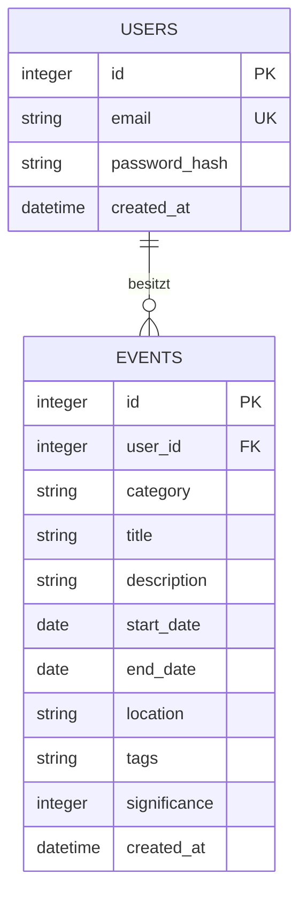

## 8. Querschnittliche Konzepte

### 8.1 Datenmodell und Persistenz

SQLite-Realisierung der Spec-Entitäten (D1/D2):

`password_hash` enthält niemals das Klartext-Passwort (siehe 8.5).
`category` ist ein String mit den erlaubten Werten `meilenstein`/`karriere`/`bildung`/`beziehung`/`reise`/`gesundheit`/`sonstiges`
(siehe Spec D2.4), serverseitig geprüft (siehe 8.2). Jeder Kategorie ist
im Frontend eine feste Akzentfarbe zugeordnet (siehe D2.4); die Farbe
wird nicht in der Datenbank gespeichert, sondern beim Rendern anhand
des Kategoriewerts nachgeschlagen. `significance` ist eine Ganzzahl
zwischen 0 und 100 und steuert die visuelle Gewichtung eines Events in
der Timeline.

### 8.2 Validierung

Der Server ist die einzige verbindliche Instanz – Browser-Prüfung ist
reine Komfortfunktion (Nachvollziehbarkeit, QG-02):

| Grenze | Prüfung | Bei Fehler |
|---|---|---|
| Browser (Komfort) | HTML5-Formularvalidierung im `EventForm` (required, Datumsformat) | Inline-Hinweis, nie verbindlich |
| Backend – Event anlegen/bearbeiten | `middleware/validation` prüft Pflichtfelder, Enddatum ≥ Startdatum, `category` gegen erlaubte Werte | 422 mit Feldfehler, nichts gespeichert |
| Backend – Registrierung/Login | E-Mail-Format, Passwort-Mindestlänge; bei Login zusätzlich Existenz-Check | 422 bzw. 401 |

**Erweiterbarkeit der Kategorien (vgl. NFA-03, QS-03):** Die zulässigen
`category`-Werte sind bewusst zentral an einer Stelle im Backend
definiert und werden sowohl von der Validierung als auch vom
Datenzugriff referenziert. Eine neue Kategorie erfordert dadurch nur
wenige, klar lokalisierte Änderungen: (1) Ergänzung in dieser zentralen
Liste, (2) Ergänzung im Frontend, (3) Ergänzung im Glossar (E2). Damit
bleibt die serverseitige Prüfung erhalten (Nachvollziehbarkeit, QG-02),
ohne dem Erweiterbarkeitsziel (QG-03, NFA-03) zu widersprechen.

### 8.3 Authentifizierung und Session

Die Entscheidung für Session-basierte Authentifizierung statt JWT ist
mit Kontext, Alternativen und Begründung in **ADR-004** (Kapitel 9)
festgehalten – hier nur die konkrete Realisierung:

- **Passwort-Hashing:** bcrypt, niemals Klartext gespeichert oder geloggt
- Session-Cookie `httpOnly` und `secure` (in Produktion), Session-Secret
  aus `.env` (siehe Kapitel 7.2, CONV-05)
- **Session-Store:** In-Memory (siehe D-02, Kapitel 11) – ausreichend für
  den Projektumfang, kein persistenter Store nötig; Sessions gehen bei
  Server-Neustart verloren, was für Demo-/Studienzwecke akzeptiert wird

### 8.4 Fehlerbehandlung

Einheitliches Muster für alle API-Endpunkte:

| Situation | HTTP-Status | Antwort |
|---|---|---|
| Validierungsfehler | 422 | Feldbezogene Fehlermeldung |
| Nicht eingeloggt | 401 | Hinweis zum Einloggen |
| Fremdes Event bearbeiten/löschen | 403 | Zugriff verweigert |
| Event nicht gefunden | 404 | "Event nicht gefunden" |
| Unerwarteter Serverfehler | 500 | Generische Meldung, keine internen Details/Stacktrace an den Client |

### 8.5 Secret-Handling und Logging

- Secrets (Session-Secret, ggf. DB-Pfad) ausschließlich in `.env`,
  niemals im Repository (siehe CONV-05, Kapitel 2)
- Passwörter werden nie geloggt, nur Ereignis + Nutzer-ID bei Fehlern
  (z. B. `"Login fehlgeschlagen", { userId }` statt der Zugangsdaten)
- Für den Projektumfang reicht einfaches Server-Logging (Konsole/Datei)
  ohne die aufwändige Redaction-Infrastruktur größerer Projekte
