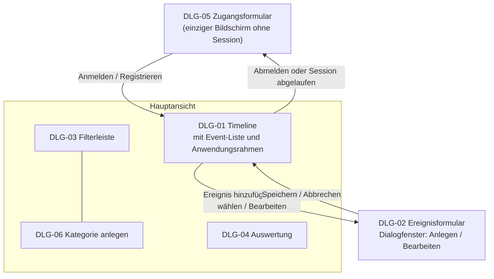
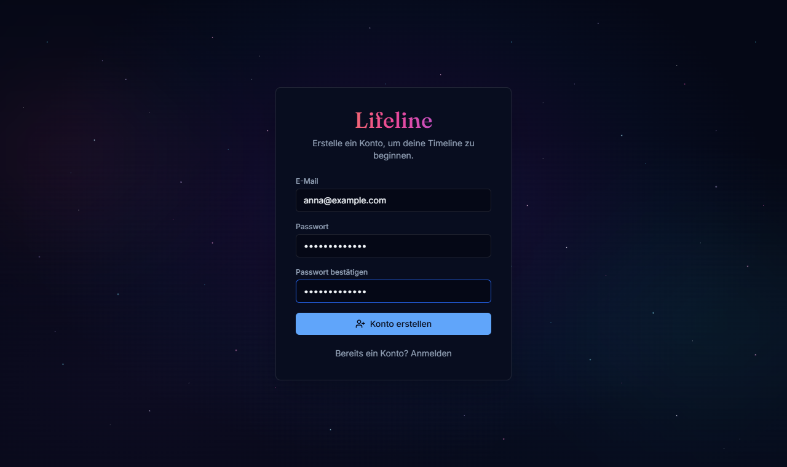
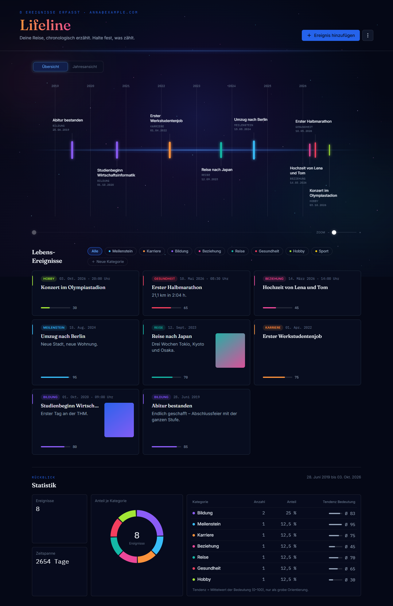
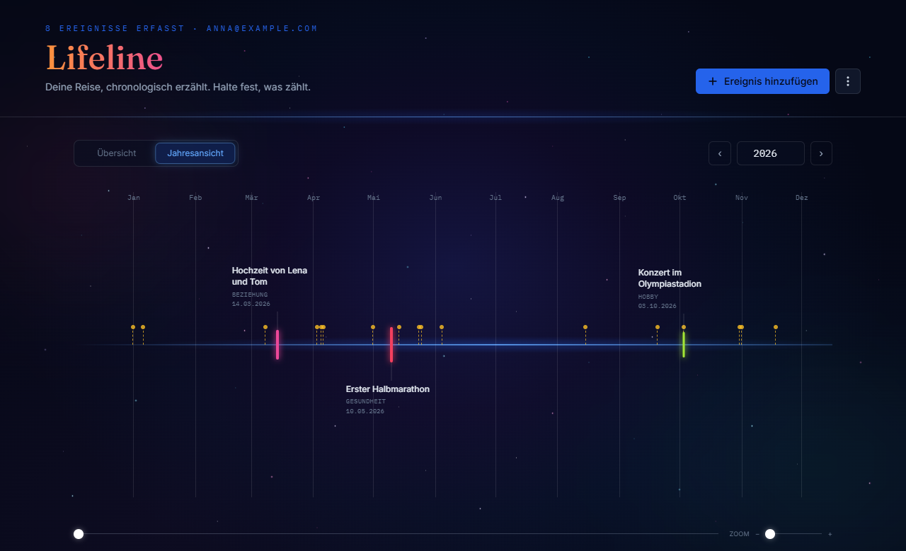
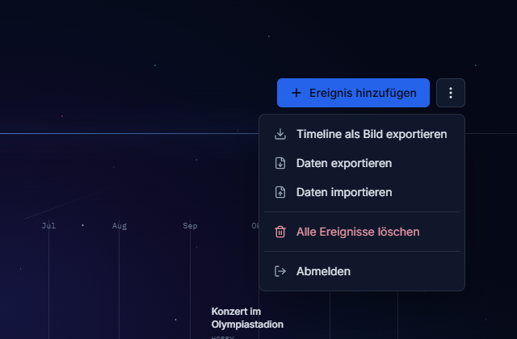
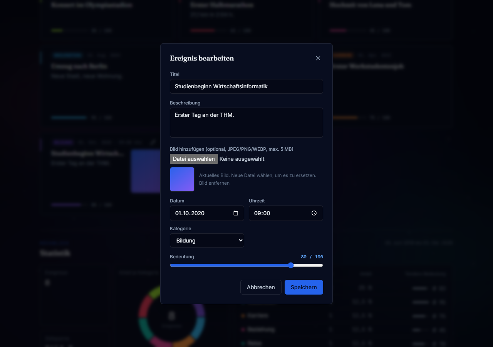
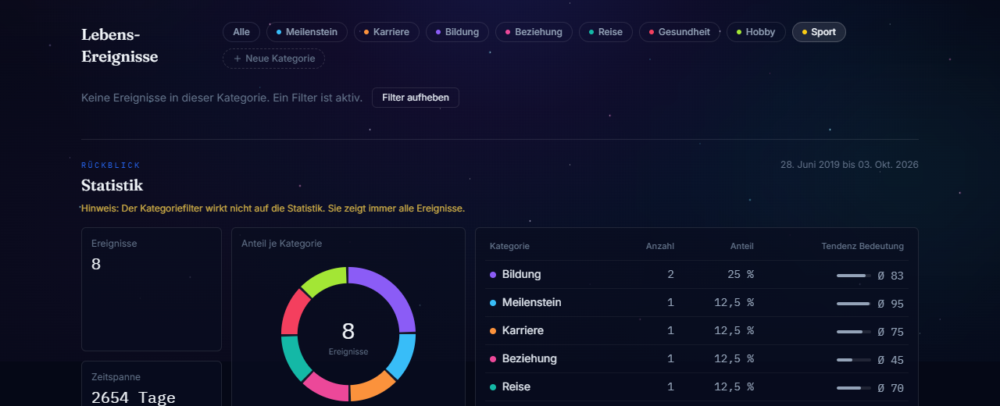
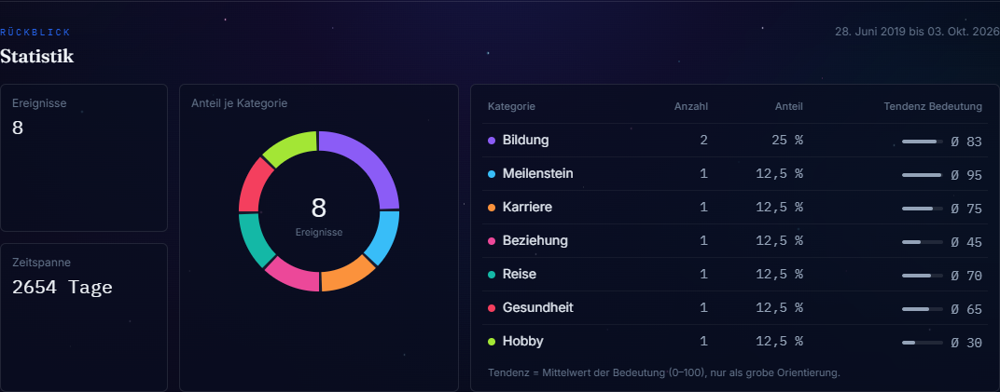
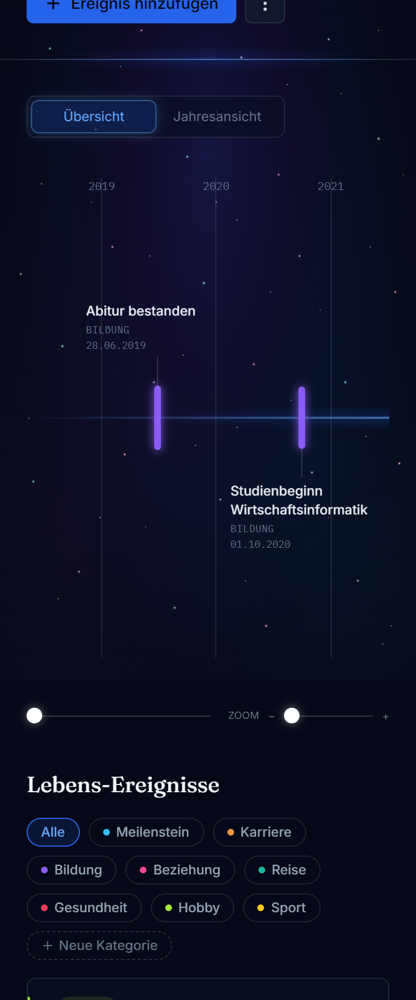

# B1 — Dialogspezifikation

Dialogspezifikation im Sinne von Siedersleben (Kap. 4.5): die Bildschirme, die Lifeline
der Nutzer:in anbietet, die Navigation zwischen ihnen und die Dialogmuster, die alle
Bildschirme teilen. B1 beschreibt, **was ein Bildschirm der Nutzer:in anbietet** und **wie
Bildschirme zusammenhängen**.

Die visuelle Identität (Farben, Typografie, Abstände) ist **nicht** Teil von B1. Ebenso
wenig die Komponentenstruktur: welche React-Komponente welchen Dialogteil rendert, steht
in [A05](../arch/A05-Bausteinansicht.md). Die Bildschirmfotos in B1.7 zeigen den
umgesetzten Stand und dienen nur der Orientierung.

Jeder Dialog realisiert einen oder mehrere Anwendungsfälle aus
[F2](F2-anwendungsfaelle.md); umgekehrt wird jeder für die Nutzer:in bedeutsame Schritt
aus F2 von genau einem Dialog dargestellt. Die Dialogkennungen (`DLG-xx`) sind stabil.

---

## B1.1 Dialogindex

Lifeline hat **zwei Bildschirme**: das Zugangsformular (ohne Session) und die
Hauptansicht (mit Session). Die Hauptansicht besteht aus mehreren Dialogteilen mit
eigener Kennung, weil sie jeweils eigene Anwendungsfälle realisieren. Das
Ereignisformular öffnet sich als Dialogfenster über der Hauptansicht.

| ID | Dialog | Form | Realisiert | Session nötig |
|---|---|---|---|:--:|
| [DLG-05](#dlg-05--zugangsformular) | Zugangsformular | eigener Bildschirm | UC-07 | nein |
| [DLG-01](#dlg-01--timeline) | Timeline | Hauptansicht | UC-04, UC-03 (inkl. „Alle löschen“), UC-09, UC-10; Einstieg für UC-01, UC-02 | ja |
| [DLG-02](#dlg-02--ereignisformular) | Ereignisformular | Dialogfenster über DLG-01 | UC-01, UC-02 | ja |
| [DLG-03](#dlg-03--filterleiste) | Filterleiste | Teil der Hauptansicht | UC-05 | ja |
| [DLG-06](#dlg-06--kategorie-anlegen) | Kategorie anlegen | Teil der Filterleiste | UC-08 | ja |
| [DLG-04](#dlg-04--auswertung) | Auswertung | Teil der Hauptansicht | UC-06 | ja |

### Navigationskarte

DLG-01 ist Einstiegs- und Rückkehrpunkt. DLG-03, DLG-06 und DLG-04 sind keine eigenen
Bildschirme, sondern fest in die Hauptansicht eingebettet und damit jederzeit erreichbar.

---

## B1.2 Aufbau der Dialogbeschreibungen

Jeder Dialog wird nach derselben Gliederung beschrieben:

| Abschnitt | Inhalt |
|---|---|
| **Kopftabelle** | Kennung, Zweck, realisierte Anwendungsfälle, Erreichbarkeit, Vorbedingung |
| **Statik** | Was dauerhaft dargestellt wird, welche Eingaben es gibt, welche Daten aus [D1](D1-datenmodell.md) sichtbar sind |
| **Dynamik** | Welche Aktionen auslösbar sind, wie der Dialog darauf reagiert, welche Zustände er annimmt |
| **Fehler- und Sonderzustände** | Leerer Zustand, Fehlermeldungen, Grenzfälle |

Verhalten, das mehrere Dialoge gleich behandeln, steht einmalig in
[B1.4](#b14-querschnittsmuster) und wird nicht je Dialog wiederholt.

---

## B1.3 Dialoge

### DLG-01 — Timeline

| Merkmal | Inhalt |
|---|---|
| **Kennung** | DLG-01 |
| **Zweck** | Chronologische Darstellung aller eigenen Events und Ausgangspunkt für alle weiteren Aktionen. |
| **Realisiert** | [UC-04](F2-anwendungsfaelle.md#uc-04--timeline-ansehen), [UC-03](F2-anwendungsfaelle.md#uc-03--event-löschen), [UC-09](F2-anwendungsfaelle.md#uc-09--sicherung-exportieren), [UC-10](F2-anwendungsfaelle.md#uc-10--sicherung-importieren); Einstieg für UC-01, UC-02 |
| **Erreichbarkeit** | Nach der Anmeldung; Rückkehrziel nach DLG-02 |
| **Vorbedingung** | Bestehende Session ([N2.3](N2-querschnittskonzepte.md#n23-authentifizierung-und-session)) |

**Statik**

- **Anwendungsrahmen** nach [B1.4.5](#b145-anwendungsrahmen).
- **Zeitachse** mit zwei Ansichten:
  - *Übersicht*: alle Jahre, in denen Events liegen, mit Jahresmarken.
  - *Jahresansicht*: ein Kalenderjahr mit Monatsmarken und Auswahl des Jahres; zusätzlich
    die gesetzlichen Feiertage als dezente Markierungen
    ([S1.3](S1-nachbarsysteme.md#s13-nb-02--feiertagsdienst)).
- Je Event auf der Zeitachse: ein Marker in der Farbe der Kategorie sowie Titel,
  Kategoriename und Datum als Text. Die Kategorie ist damit nie nur an der Farbe
  erkennbar ([B1.4.7](#b147-farbe-ist-nie-das-einzige-merkmal)).
- Die Bedeutung bestimmt die **Größe** des Markers. Sie wird als Rangfolge dargestellt,
  nicht als Maßzahl ([D2.2](D2-datentypenverzeichnis.md#d22-wertebereich-von-significance)).
- Jedes Event ist ein Zeitpunkt, kein Zeitraum; es gibt keine Balkendarstellung.
- Reihenfolge nach `date`, bei gleichem Datum nach `time`; Events ohne Uhrzeit stehen am
  Ende des Tages ([NFR-12c-01](N1-nichtfunktional.md)).
- **Event-Liste** unter der Zeitachse: je Event eine Karte mit Kategorie, Datum, ggf.
  Uhrzeit, Titel, Beschreibung, Bild und Bedeutung als Balken mit Zahl (z. B. „95“; Tooltip
  und Screenreader: „Bedeutung 95 von 100“), neueste zuerst.
- Eingebettet: die Filterleiste [DLG-03](#dlg-03--filterleiste) mit
  [DLG-06](#dlg-06--kategorie-anlegen) und die Auswertung [DLG-04](#dlg-04--auswertung).

**Dynamik**

| Aktion | Wirkung |
|---|---|
| Ereignis hinzufügen | Öffnet [DLG-02](#dlg-02--ereignisformular) im Anlegemodus. |
| Event auf der Zeitachse wählen | Öffnet DLG-02 im Bearbeitungsmodus mit den vorhandenen Werten. |
| Bearbeiten an einer Karte | Öffnet DLG-02 im Bearbeitungsmodus. |
| Löschen an einer Karte | Rückfrage nach [B1.4.3](#b143-bestätigung-zerstörerischer-aktionen), danach Entfernen aus der Darstellung. |
| Übersicht / Jahresansicht | Wechselt die Ansicht der Zeitachse über einen Umschalter. Der Wechsel ist fließend: Events gleiten an ihre neue Position, Events anderer Jahre blenden aus (bei „Bewegung reduzieren“ ohne Animation). |
| Jahr wählen (vor, zurück, Eingabe) | Zeigt ein anderes Jahr in der Jahresansicht und lädt dessen Feiertage. |
| Horizontal navigieren | Verschiebt den sichtbaren Zeitbereich (Wischen, Scrollen oder Positionsregler). |
| Zoom ändern | Ändert die Breite der Zeitachse. |
| Menü: Timeline als Bild exportieren | Lädt die aktuelle Darstellung als PNG herunter ([AF-04](F3-anwendungsfunktionen.md#af-04--timeline-export)). Erweiterung. |
| Menü: Daten exportieren | Lädt eine Sicherungsdatei (JSON) herunter (UC-09). Erweiterung. |
| Menü: Daten importieren | Wählt eine Sicherungsdatei, fragt nach und importiert die Events zusätzlich (UC-10, [AF-05](F3-anwendungsfunktionen.md#af-05--kategorien-beim-import-zuordnen)); meldet anschließend die Anzahl. Erweiterung. |
| Menü: Alle Ereignisse löschen | Rückfrage nach B1.4.3, danach werden alle eigenen Events gelöscht (UC-03). |
| Menü: Abmelden | Beendet die Session und führt zu DLG-05. |

Ansicht, Jahr, Zoom und aktiver Filter sind **flüchtiger Anzeigezustand**: sie werden
nicht gespeichert und sind deshalb kein Gegenstand von [D1](D1-datenmodell.md).

Nach jedem Anlegen, Bearbeiten, Löschen und Import werden Darstellung und Auswertung
unmittelbar aktualisiert. Ein aktiver Filter bleibt dabei erhalten; nach einem Import
wird er aufgehoben, damit alle importierten Events sichtbar sind.

**Fehler- und Sonderzustände**

- Events nicht ladbar: Meldung nach [B1.4.2](#b142-fehlermeldungen) mit der Schaltfläche
  „Erneut laden“.
- Keine Events vorhanden: leerer Zustand nach [B1.4.4](#b144-leere-zustände) mit der
  Schaltfläche „Erstes Ereignis anlegen“; die Zeitachse zeigt die Jahresansicht.
- Events vorhanden, aber keines passt zum Filter: leerer Zustand mit dem Hinweis, dass ein
  Filter aktiv ist, und der Schaltfläche „Filter aufheben“. **Nicht** als Fehler darstellen.
- Keine Events im gewählten Jahr: Hinweis unter der Zeitachse.
- Feiertagsdienst nicht erreichbar: keine Markierungen, keine Meldung
  ([S1.3.2](S1-nachbarsysteme.md#s132-bindende-regel-fehlerverhalten)).
- Ungültige Sicherungsdatei: Meldung, es wird nichts importiert.

---

### DLG-02 — Ereignisformular

| Merkmal | Inhalt |
|---|---|
| **Kennung** | DLG-02 |
| **Zweck** | Erfassen eines neuen und Ändern eines vorhandenen Events. |
| **Realisiert** | [UC-01](F2-anwendungsfaelle.md#uc-01--event-anlegen), [UC-02](F2-anwendungsfaelle.md#uc-02--event-bearbeiten) |
| **Erreichbarkeit** | Aus DLG-01, als Dialogfenster über der Hauptansicht |
| **Vorbedingung** | Bestehende Session. Im Bearbeitungsmodus zusätzlich: das Event gehört der angemeldeten Nutzer:in ([NFR-15a-02](N1-nichtfunktional.md)). |

**Zwei Zustände.** Anlege- und Bearbeitungsmodus teilen Felder, Prüfregeln und Verhalten.
Sie unterscheiden sich in drei Punkten: der Bearbeitungsmodus ist mit den vorhandenen
Werten vorbelegt, seine Überschrift und Schaltfläche benennen das Ändern, und er ändert
einen Datensatz, statt einen anzulegen.

**Statik — Eingaben**

| Feld | Pflicht | Regel |
|---|:--:|---|
| Titel | ● | 1–120 Zeichen ([D2.7](D2-datentypenverzeichnis.md#d27-titel-und-beschreibung)) |
| Beschreibung | | Freitext, höchstens 2000 Zeichen |
| Bild | | ein Bild; JPEG, PNG oder WEBP bis 5 MB ([D2.3](D2-datentypenverzeichnis.md#d23-bild-image_path)) |
| Datum | ● | gültiges Datum, vorbelegt mit dem heutigen Tag ([D2.5](D2-datentypenverzeichnis.md#d25-kalenderdatum)) |
| Uhrzeit | | leer vorbelegt; nur relevant zur Reihenfolge innerhalb eines Tages ([D2.6](D2-datentypenverzeichnis.md#d26-uhrzeit)) |
| Kategorie | ● | Auswahl aus den eigenen Kategorien (`INV-C4`), vorbelegt mit der ersten Kategorie der Person |
| Bedeutung | ● | Regler 0–100, vorbelegt mit 50, angezeigt als „50 / 100“ ([D2.2](D2-datentypenverzeichnis.md#d22-wertebereich-von-significance)) |

Die Kategorieauswahl zeigt `label`, arbeitet aber auf der Kennung der Kategorie. Fehlt
eine passende Kategorie, legt die Nutzer:in sie zuvor in der Filterleiste an
([DLG-06](#dlg-06--kategorie-anlegen)).

**Dynamik**

| Aktion | Wirkung |
|---|---|
| Hinzufügen / Speichern | Prüfung nach [N2.2](N2-querschnittskonzepte.md#n22-validierung); bei Erfolg schließt das Formular und DLG-01 wird aktualisiert. |
| Abbrechen, Schließen-Symbol oder Escape | Schließt ohne Änderung. Wurden Werte geändert, erst nach Rückfrage nach [B1.4.3](#b143-bestätigung-zerstörerischer-aktionen). |
| Bild wählen | Das Bild wird eingelesen; bis dahin ist Speichern gesperrt. |
| Bild entfernen | Setzt den Bildverweis zurück; wirksam erst mit dem Speichern. |

**Fehler- und Sonderzustände**

- Fehlende Pflichtangabe: Hinweis direkt am Feld; das Formular wird nicht abgeschickt.
- Unzulässiges Bild: Meldung am Bildfeld, das Bild wird nicht übernommen.
- Von der Anwendungslogik abgewiesene Eingabe oder fehlgeschlagene Speicherung: Meldung nach
  [B1.4.2](#b142-fehlermeldungen); das Formular bleibt geöffnet und behält alle Eingaben
  ([N2.4](N2-querschnittskonzepte.md#n24-fehlerbehandlung)).

---

### DLG-03 — Filterleiste

| Merkmal | Inhalt |
|---|---|
| **Kennung** | DLG-03 |
| **Zweck** | Eingrenzen der dargestellten Events auf eine Kategorie. |
| **Realisiert** | [UC-05](F2-anwendungsfaelle.md#uc-05--timeline-filtern) |
| **Erreichbarkeit** | Fest eingebettet in die Hauptansicht, oberhalb der Event-Liste |
| **Vorbedingung** | Bestehende Session |

**Statik**

Eine Schaltfläche „Alle“ und je eigene Kategorie eine Schaltfläche mit Farbpunkt **und**
Namen. Der aktive Filter ist hervorgehoben. Die Liste wächst automatisch mit, sobald in
DLG-06 eine Kategorie angelegt wird. Am Ende steht „Neue Kategorie“ (DLG-06).

**Dynamik**

Die Auswahl wirkt unmittelbar auf Zeitachse und Event-Liste und arbeitet auf den **bereits
geladenen** Events ([AF-03](F3-anwendungsfunktionen.md#af-03--timeline-filterung)) — es
wird nichts nachgeladen ([NFR-12a-02](N1-nichtfunktional.md)). „Alle“ hebt den Filter auf.

**Fehler- und Sonderzustände**

Keine eigenen. Eine leere Ergebnismenge ist ein Zustand von DLG-01, kein Fehler.

---

### DLG-06 — Kategorie anlegen

| Merkmal | Inhalt |
|---|---|
| **Kennung** | DLG-06 |
| **Zweck** | Eigene Kategorien anlegen. |
| **Realisiert** | [UC-08](F2-anwendungsfaelle.md#uc-08--kategorie-anlegen) |
| **Erreichbarkeit** | Über „Neue Kategorie“ am Ende der Filterleiste (DLG-03) |
| **Vorbedingung** | Bestehende Session |

Dieser Dialogteil ist die Oberfläche zu [NFR-14c-01](N1-nichtfunktional.md): ohne ihn
bliebe die Erweiterbarkeit der Kategorien eine Behauptung.

**Statik — Eingaben**

| Feld | Pflicht | Regel |
|---|:--:|---|
| Farbe | ● | Farbwähler, vorbelegt mit einem Vorschlag aus einer festen Palette ([D2.8](D2-datentypenverzeichnis.md#d28-kategoriename-und-farbcode)) |
| Name | ● | 1–40 Zeichen, bei der Person eindeutig |

**Dynamik**

| Aktion | Wirkung |
|---|---|
| OK | Legt die Kategorie an; sie erscheint sofort in DLG-03 und in der Auswahl von DLG-02. Die Eingabezeile schließt sich. |
| Abbrechen | Schließt die Eingabezeile ohne Änderung. |

**Fehler- und Sonderzustände**

- Name bereits vergeben (`INV-C1`) oder ungültig: Meldung direkt unter der Filterleiste; die
  Eingabe bleibt erhalten.

Umbenennen, Umfärben und Löschen eigener Kategorien sind bewusst nicht Teil dieses Dialogs
([OP-06](../OFFENE-PUNKTE.md)).

---

### DLG-04 — Auswertung

| Merkmal | Inhalt |
|---|---|
| **Kennung** | DLG-04 |
| **Zweck** | Verdichtete Rückschau auf den eigenen Bestand. |
| **Realisiert** | [UC-06](F2-anwendungsfaelle.md#uc-06--statistik-berechnen) |
| **Erreichbarkeit** | Fest eingebettet in die Hauptansicht, unterhalb der Event-Liste („Rückblick – Statistik“) |
| **Vorbedingung** | Bestehende Session. Erweiterung, kein Muss-Umfang. |

**Statik**

Die Kennzahlen aus [AF-02](F3-anwendungsfunktionen.md#af-02--statistik-aggregation),
in drei Teilen nebeneinander (auf dem Smartphone untereinander):

- Kacheln mit Anzahl Events und Zeitspanne in Tagen; darüber der Zeitraum vom ältesten bis
  zum jüngsten Event.
- Ein **Ringdiagramm** mit dem Anteil jeder Kategorie an allen Events, in der Farbe der
  Kategorie; in der Mitte die Gesamtzahl. Größte Kategorie zuerst, bei Gleichstand in der
  Reihenfolge der Filterleiste. Kleine Lücken trennen die Segmente, weil sich einige
  Kategoriefarben bei Farbfehlsichtigkeit ähneln.
- Eine **Tabelle** je Kategorie mit Name, Anzahl, Anteil (eine Nachkommastelle) und Tendenz
  der Bedeutung („Ø 95“). Sie ist zugleich Legende des Rings und Textfassung der Grafik;
  keine Information steht nur im Ring (B1.4.7).

Die Mittelwerte sind als **Tendenz** beschriftet, nicht als „durchschnittliche
Wichtigkeit“: die Bedeutungsskala ist ordinal, eine Mittelwertbildung darauf ist streng
genommen nicht zulässig und dient nur als grobe Orientierung
([D2.2](D2-datentypenverzeichnis.md#d22-wertebereich-von-significance)).

**Dynamik**

Die Ansicht ist lesend. Sie wird nach jedem Anlegen, Bearbeiten, Löschen und Import neu
ermittelt. Beim ersten Anzeigen baut sich der Ring einmal auf (bei „Bewegung reduzieren“
ohne Animation).

Wird eine Tabellenzeile oder ein Segment mit der Maus überfahren oder per Tastatur
fokussiert, wird die Kategorie in Tabelle und Ring hervorgehoben, die übrigen Segmente
treten zurück, und die Mitte des Rings zeigt Name, Anzahl und Anteil.

Ein in DLG-03 gesetzter Filter wirkt **nicht** auf die Auswertung: sie betrachtet stets
den vollständigen Bestand. Solange ein Filter aktiv ist, weist ein Hinweis darauf hin.

**Fehler- und Sonderzustände**

- Keine Events vorhanden: neutrale Werte (0), ein leerer Ring und „Noch keine
  Ereignisse“; der Zeitraum entfällt.
- Kennzahlen nicht ermittelbar: Die Auswertung wird ausgeblendet; die Timeline bleibt
  nutzbar.

---

### DLG-05 — Zugangsformular

| Merkmal | Inhalt |
|---|---|
| **Kennung** | DLG-05 |
| **Zweck** | Anlegen eines Kontos und Anmelden an einem vorhandenen Konto. |
| **Realisiert** | [UC-07](F2-anwendungsfaelle.md#uc-07--registrieren-und-login) |
| **Erreichbarkeit** | Einziger ohne Session erreichbarer Bildschirm; Ziel der Umleitung nach [B1.4.1](#b141-umleitung-ohne-session) |
| **Vorbedingung** | Keine |

**Zwei Zustände.** *Anmelden* und *Registrieren* sind zwei Zustände desselben Dialogs mit
direktem Wechsel zwischen beiden. Sie teilen die Felder E-Mail und Passwort; die
Registrierung fordert zusätzlich eine Bestätigung des Passworts.

**Statik — Eingaben**

| Feld | Zustand | Pflicht |
|---|---|:--:|
| E-Mail | beide | ● |
| Passwort | beide | ● (bei Registrierung mindestens 8 Zeichen) |
| Passwort bestätigen | nur Registrieren | ● |

**Dynamik**

| Aktion | Wirkung |
|---|---|
| Anmelden | Bei gültigen Zugangsdaten wird eine Session eingerichtet und DLG-01 angezeigt. |
| Konto erstellen | Bei gültigen Eingaben wird ein Konto mit den Startkategorien angelegt und die Nutzer:in angemeldet. |
| Zustand wechseln | Wechsel zwischen Anmelden und Registrieren ohne Verlassen des Dialogs. |

**Fehler- und Sonderzustände**

- Ungültige Zugangsdaten: **eine** allgemeine Meldung, die nicht verrät, ob die Adresse
  unbekannt oder das Passwort falsch war.
- Passwörter stimmen nicht überein oder Passwort zu kurz: Meldung im Formular, keine
  Anfrage an die Anwendungslogik.
- Bereits vergebene E-Mail bei der Registrierung (`INV-U1`): Meldung im Formular.
- Es gibt **keinen** Weg, ein vergessenes Passwort zurückzusetzen. Bewusste Lücke, siehe
  [OP-03](../OFFENE-PUNKTE.md).

---

## B1.4 Querschnittsmuster

Verhalten, das alle Dialoge gleich behandeln. Einmal hier festgelegt statt je Dialog
wiederholt.

### B1.4.1 Umleitung ohne Session

Wird Lifeline ohne gültige Session geöffnet oder läuft die Session während der Nutzung ab
(z. B. nach einem Neustart der Anwendung), führt Lifeline beim nächsten Zugriff zu DLG-05.
Nach erfolgreicher Anmeldung wird die Hauptansicht angezeigt; die Daten sind unverändert.

### B1.4.2 Fehlermeldungen

Fehler werden möglichst dort gemeldet, wo sie entstehen: Hinweise zu Pflichtfeldern und
zum Bild am Feld, Fehler beim Laden in der Hauptansicht, Fehler beim Anlegen einer
Kategorie unter der Filterleiste. Vom Server abgewiesene Speicher-, Lösch- und
Importvorgänge werden als Meldungsfenster angezeigt. Jede Meldung sagt, was nicht möglich
war; interne Einzelheiten — Statuscodes, technische Meldungen, Stapelspuren — erscheinen
nie in der Oberfläche ([NFR-11c-01](N1-nichtfunktional.md),
[N2.4](N2-querschnittskonzepte.md#n24-fehlerbehandlung)).

### B1.4.3 Bestätigung zerstörerischer Aktionen

Aktionen, die Daten unwiederbringlich entfernen oder Eingaben verwerfen, werden erst nach
ausdrücklicher Bestätigung ausgeführt. Die Rückfrage benennt konkret, was geschieht:
„Dieses Ereignis wirklich löschen?“, „Wirklich alle Ereignisse unwiderruflich löschen?“,
„Ungespeicherte Eingaben verwerfen?“. Auch der Import wird vorher bestätigt, weil er den
Bestand verändert.

### B1.4.4 Leere Zustände

Ein leerer Bestand ist kein Fehler. Leere Zustände erklären, warum nichts zu sehen ist,
und bieten den nächsten sinnvollen Schritt an — beim leeren Bestand das Anlegen eines
Events, bei leerer Filtermenge das Aufheben des Filters.

### B1.4.5 Anwendungsrahmen

Die Hauptansicht trägt oben einen festen Rahmen: Anzahl der erfassten Events und E-Mail
der angemeldeten Person, die Schaltfläche „Ereignis hinzufügen“ und ein Menü mit
„Timeline als Bild exportieren“, „Daten exportieren“, „Daten importieren“, „Alle
Ereignisse löschen“ und „Abmelden“. Filterleiste und Auswertung sind ohne Navigation in der
Hauptansicht erreichbar.

### B1.4.6 Bedienung auf Desktop und Smartphone

Alle Dialoge sind auf beiden Gerätearten vollständig bedienbar
([CON-3e-01](P1-constraints.md#con-3e-01-desktop-und-smartphone-gleichrangig),
[NFR-10a-01](N1-nichtfunktional.md)). Für die Zeitachse heißt das: horizontales Navigieren
per Wischen und Zoomen über einen Regler. Aktionen, die auf dem Desktop erst beim
Überfahren mit der Maus erscheinen (Bearbeiten und Löschen an den Karten), sind auf
Touch-Geräten immer sichtbar.

### B1.4.7 Farbe ist nie das einzige Merkmal

Wo Kategorien farblich unterschieden werden, ist die Kategorie zusätzlich als Text
erkennbar ([NFR-11d-01](N1-nichtfunktional.md)). Das gilt für die Zeitachse und die Karten
in DLG-01 sowie für DLG-03 und DLG-04 — und es ist der Grund, warum eine Kategorie nicht
allein über `color` identifiziert werden darf.

---

## B1.5 Nicht Teil von B1

- **Visuelle Gestaltung.** Farbwerte, Schriften, Abstände, Komponentenbibliothek.
- **Komponentenstruktur des Frontends** — [A05](../arch/A05-Bausteinansicht.md).
- **Abläufe zwischen Nutzer:in und System.** Sie stehen als Anwendungsfälle in
  [F2](F2-anwendungsfaelle.md); B1 beschreibt die Oberfläche, auf der sie stattfinden.
- **Algorithmen hinter den Aktionen** — [F3](F3-anwendungsfunktionen.md).
- **Adressen und Routen.** Lifeline hat keine eigenen Adressen je Dialog.

---

## B1.6 Querverweise

| Baustein | Bezug zu B1 |
|---|---|
| [F2](F2-anwendungsfaelle.md) | Jeder Anwendungsfall ist einem Dialog zugeordnet (B1.1). |
| [F3](F3-anwendungsfunktionen.md) | AF-03 wirkt in DLG-03, AF-02 in DLG-04, AF-04 und AF-05 in DLG-01. |
| [D1](D1-datenmodell.md) | DLG-02 bildet `EVENTS` ab, DLG-06 bildet `CATEGORIES` ab; beide setzen deren Invarianten (D1.7) um. |
| [D2](D2-datentypenverzeichnis.md) | Die Eingaberegeln in DLG-02, DLG-05 und DLG-06 folgen D2. |
| [N1](N1-nichtfunktional.md) | `NFR-10a-01`, `NFR-11a-01`, `NFR-11c-01`, `NFR-11d-01` binden die Dialoge; `NFR-14c-01` ist der Grund für DLG-06. |
| [N2](N2-querschnittskonzepte.md) | B1.4.1 bis B1.4.3 sind die Oberflächenseite von N2.3 und N2.4. |
| [A05](../arch/A05-Bausteinansicht.md) | Ordnet den Dialogen die umsetzenden Frontend-Bausteine zu. |

---

## B1.7 Bildschirmfotos (Umsetzungsstand)

| Dialog | Bild |
|---|---|
| DLG-05 Zugangsformular (Registrieren) |  |
| DLG-01 Timeline, Übersicht, mit DLG-03 und DLG-04 |  |
| DLG-01 Timeline, Jahresansicht mit Feiertagen |  |
| DLG-01 Menü des Anwendungsrahmens |  |
| DLG-02 Ereignisformular |  |
| DLG-03 Filter aktiv, leere Filtermenge |  |
| DLG-06 Kategorie anlegen |  |
| DLG-04 Auswertung mit Ringdiagramm |  |
| DLG-01 auf dem Smartphone (375 px) |  |
