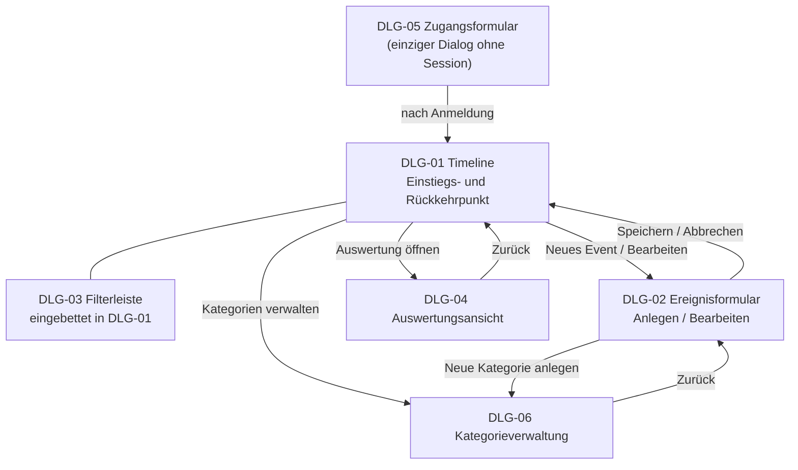

# B1 — Dialogspezifikation

Dialogspezifikation im Sinne von Siedersleben (Kap. 4.5): die Bildschirme, die Lifeline
der Nutzer:in anbietet, die Navigation zwischen ihnen und die Dialogmuster, die alle
Bildschirme teilen. B1 beschreibt, **was ein Bildschirm der Nutzer:in anbietet** und **wie
Bildschirme zusammenhängen** — unabhängig von Gestaltungssprache, Komponentenbibliothek
und Frontend-Technologie.

Die visuelle Identität (Farben, Typografie, Abstände) ist **nicht** Teil von B1. Ebenso
wenig die Komponentenstruktur: welche React-Komponente welchen Dialogteil rendert, steht
in [A05](../arch/A05-Bausteinansicht.md).

Jeder Dialog realisiert einen oder mehrere Anwendungsfälle aus
[F2](F2-anwendungsfaelle.md); umgekehrt wird jeder für die Nutzer:in bedeutsame Schritt
aus F2 von genau einem Dialog dargestellt. Die Dialogkennungen (`DLG-xx`) sind stabil.

---

### B1.1 Dialogindex

| ID | Dialog | Gruppe | Realisiert | Session nötig |
|---|---|---|---|:--:|
| [DLG-01](#dlg-01--timeline) | Timeline | Chronik | UC-04; Einstieg für UC-01 bis UC-03, UC-05, UC-06 | ja |
| [DLG-02](#dlg-02--ereignisformular) | Ereignisformular | Chronik | UC-01, UC-02 | ja |
| [DLG-03](#dlg-03--filterleiste) | Filterleiste | Chronik | UC-05 | ja |
| [DLG-04](#dlg-04--auswertungsansicht) | Auswertungsansicht | Auswertung | UC-06 | ja |
| [DLG-05](#dlg-05--zugangsformular) | Zugangsformular | Zugang | UC-07 | nein |
| [DLG-06](#dlg-06--kategorieverwaltung) | Kategorieverwaltung | Stammdaten | UC-08 | ja |

### Navigationskarte

DLG-01 ist Einstiegs- und Rückkehrpunkt: jede Aktion in DLG-02, DLG-04 und DLG-06 endet
wieder dort. DLG-03 ist kein eigener Bildschirm, sondern ein fest in DLG-01 eingebetteter
Dialogteil; er erhält eine eigene Kennung, weil er einen eigenen Anwendungsfall
realisiert.

**Ebenfalls offen:** für „Alle Events löschen" existiert kein Dialog. Zu ergänzen ist
voraussichtlich eine Aktion in DLG-01 mit einer Rückfrage nach
[B1.4.3](#b143-bestätigung-zerstörerischer-aktionen) (OP-01).

---

## B1.2 Aufbau der Dialogbeschreibungen

Jeder Dialog wird nach derselben Gliederung beschrieben:

| Abschnitt | Inhalt |
|---|---|
| **Kopftabelle** | Kennung, Zweck, realisierte Anwendungsfälle, Erreichbarkeit, Vorbedingung |
| **Statik** | Was dauerhaft dargestellt wird, welche Eingaben es gibt, welche Daten aus [D1](D1-datenmodell.md) sichtbar sind |
| **Dynamik** | Welche Aktionen auslösbar sind, wie der Dialog darauf reagiert, welche Zustände er annimmt |
| **Fehler- und Sonderzustände** | Leerer Zustand, Fehlermeldungen, Grenzfälle |

Verhalten, das mehrere Dialoge gleich behandeln, steht einmalig in
[B1.4](#b14-querschnittsmuster) und wird nicht je Dialog wiederholt.

---

## B1.3 Dialoge

### DLG-01 — Timeline

| Merkmal | Inhalt |
|---|---|
| **Kennung** | DLG-01 |
| **Zweck** | Chronologische Darstellung aller eigenen Events und Einstiegspunkt für alle weiteren Aktionen. |
| **Realisiert** | [UC-04](F2-anwendungsfaelle.md); Einstieg für UC-01, UC-02, UC-03, UC-05, UC-06 |
| **Erreichbarkeit** | Einstiegsdialog nach der Anmeldung; Rückkehrziel aus allen anderen Dialogen |
| **Vorbedingung** | Bestehende Session ([N2.3](N2-querschnittskonzepte.md#n23-authentifizierung-und-session)) |

**Statik**

- Horizontale Zeitachse mit den Events der angemeldeten Nutzer:in in chronologischer
  Reihenfolge, positioniert nach `date`. Bei gleichem Datum entscheidet die optionale
  Uhrzeit über die Reihenfolge ([NFR-12c-01](N1-nichtfunktional.md)).
- Je Event mindestens: Titel, Datum, Kategorie. Die Kategorie ist farblich unterschieden —
  die Farbe stammt aus dem Attribut `color` der Kategorie
  ([D1.3](D1-datenmodell.md#d13-categories)), der Anzeigename aus `label`.
- Die Bedeutung bestimmt die visuelle Gewichtung des Eintrags. Sie wird als **Rangfolge**
  dargestellt, nicht als Maßzahl
  ([D2.2](D2-datentypenverzeichnis.md#d22-wertebereich-von-significance)).
- Jedes Event ist ein Zeitpunkt, kein Zeitraum. Es gibt keine Balkendarstellung über eine
  Dauer ([D1.4](D1-datenmodell.md#d14-events)).
- Eingebettet: die Filterleiste [DLG-03](#dlg-03--filterleiste).

**Dynamik**

| Aktion | Wirkung |
|---|---|
| Event auswählen | Zusätzliche Angaben werden eingeblendet: Beschreibung, Uhrzeit und Bild. |
| Neues Event anlegen | Öffnet [DLG-02](#dlg-02--ereignisformular) im Anlegemodus. |
| Event bearbeiten | Öffnet DLG-02 im Bearbeitungsmodus mit den vorhandenen Werten. |
| Event löschen | Rückfrage nach [B1.4.3](#b143-bestätigung-zerstörerischer-aktionen), danach Entfernen aus der Darstellung. |
| Horizontal navigieren | Verschiebt den sichtbaren Zeitbereich. |
| Zoomstufe ändern | Ändert die dargestellte Zeitspanne. |
| Auswertung öffnen | Öffnet [DLG-04](#dlg-04--auswertungsansicht). |
| Kategorien verwalten | Öffnet [DLG-06](#dlg-06--kategorieverwaltung). |
| Darstellung als Bild ausleiten | Erzeugt eine Abbildung des aktuell Sichtbaren ([AF-04](F3-anwendungsfunktionen.md)). Erweiterung, nicht Muss. |

Sichtbarer Zeitbereich, Zoomstufe und aktiver Filter sind **flüchtiger Anzeigezustand**:
sie werden nicht gespeichert und sind deshalb kein Gegenstand von
[D1](D1-datenmodell.md#d11-übersicht).

Nach jedem Anlegen, Bearbeiten oder Löschen wird die Darstellung unmittelbar aktualisiert.
Ein aktiver Filter bleibt dabei erhalten.

**Fehler- und Sonderzustände**

- Events nicht ladbar: Meldung nach [B1.4.2](#b142-fehlermeldungen) mit der Möglichkeit,
  erneut zu laden.
- Keine Events vorhanden: leerer Zustand nach [B1.4.4](#b144-leere-zustände) mit
  unmittelbarem Weg zum Anlegen.
- Events vorhanden, aber keines passt zum Filter: leerer Zustand mit dem Hinweis, dass ein
  Filter aktiv ist, und der Möglichkeit, ihn aufzuheben. **Nicht** als Fehler darstellen.

---

### DLG-02 — Ereignisformular

| Merkmal | Inhalt |
|---|---|
| **Kennung** | DLG-02 |
| **Zweck** | Erfassen eines neuen und Ändern eines vorhandenen Events. |
| **Realisiert** | [UC-01](F2-anwendungsfaelle.md), [UC-02](F2-anwendungsfaelle.md) |
| **Erreichbarkeit** | Aus DLG-01 |
| **Vorbedingung** | Bestehende Session. Im Bearbeitungsmodus zusätzlich: das Event gehört der angemeldeten Nutzer:in ([NFR-15a-02](N1-nichtfunktional.md)). |

**Zwei Zustände.** Anlege- und Bearbeitungsmodus teilen Felder, Prüfregeln und Verhalten.
Sie unterscheiden sich in drei Punkten: der Bearbeitungsmodus ist mit den vorhandenen
Werten vorbelegt, seine Beschriftung benennt das Ändern, und er ändert einen Datensatz,
statt einen anzulegen.

**Statik — Eingaben**

| Feld | Pflicht | Regel |
|---|:--:|---|
| Titel | ● | nicht leer |
| Datum | ● | gültiges Datum; bestimmt die Position in der Timeline |
| Uhrzeit | | gültige Uhrzeit; nur relevant zur Feinsortierung innerhalb eines Tages |
| Beschreibung | | Freitext |
| Kategorie | ● | Auswahl aus den für diese Nutzer:in sichtbaren Kategorien: die vorbelegten Standardkategorien und ihre eigenen (`INV-C4`). Vorbelegt mit der ersten Kategorie der Person (nach Anlagereihenfolge). |
| Bedeutung | ● | Regler 0–100 ([D2.2](D2-datentypenverzeichnis.md#d22-wertebereich-von-significance)), vorbelegt mit einem mittleren Wert |
| Bild | | ein Bild; Formate und Größe nach [D2.3](D2-datentypenverzeichnis.md#d23-bild-image_path) |

Die Kategorieauswahl zeigt `label`, arbeitet aber auf der Kennung der Kategorie. Der
Anzeigename kann sich ändern, ohne dass bestehende Events ihre Zuordnung verlieren.

**Dynamik**

| Aktion | Wirkung |
|---|---|
| Speichern | Prüfung nach [N2.2](N2-querschnittskonzepte.md#n22-validierung); bei Erfolg Rückkehr zu DLG-01 mit aktualisierter Darstellung. |
| Abbrechen | Rückkehr zu DLG-01 ohne Änderung. Bei bereits eingegebenen Werten Rückfrage nach [B1.4.3](#b143-bestätigung-zerstörerischer-aktionen). |
| Neue Kategorie anlegen | Öffnet [DLG-06](#dlg-06--kategorieverwaltung); nach Rückkehr ist die neue Kategorie auswählbar und die bisherigen Eingaben sind erhalten. |
| Bild entfernen | Setzt den Bildverweis zurück; wirksam erst mit dem Speichern. |

**Fehler- und Sonderzustände**

- Verletzte Prüfregel: Rückmeldung **am betroffenen Feld**, nicht als globale Meldung. Das
  Formular behält alle Eingaben.
- Abgewiesener Bildupload: Meldung am Bildfeld; das Event wird nicht gespeichert,
  bis der ungültige Upload entfernt oder ersetzt wurde.
- Fehlgeschlagene Speicherung: Meldung nach [B1.4.2](#b142-fehlermeldungen); Eingaben
  bleiben erhalten, damit sie nicht erneut erfasst werden müssen
  ([N2.4](N2-querschnittskonzepte.md#n24-fehlerbehandlung)).

---

### DLG-03 — Filterleiste

| Merkmal | Inhalt |
|---|---|
| **Kennung** | DLG-03 |
| **Zweck** | Eingrenzen der dargestellten Events auf eine Kategorie. |
| **Realisiert** | [UC-05](F2-anwendungsfaelle.md) |
| **Erreichbarkeit** | Fest eingebettet in DLG-01 |
| **Vorbedingung** | Bestehende Session |

**Statik**

Auswahl über die für diese Nutzer:in sichtbaren Kategorien sowie den Zustand „kein
Filter". Der aktive Filter ist jederzeit erkennbar. Die angebotene Liste wächst
automatisch mit, sobald in DLG-06 eine Kategorie angelegt wird.

**Dynamik**

Die Auswahl wirkt unmittelbar auf DLG-01 und arbeitet auf den **bereits geladenen**
Events ([AF-03](F3-anwendungsfunktionen.md)) — es wird nichts nachgeladen
([NFR-12a-02](N1-nichtfunktional.md)). Der Filter lässt sich jederzeit wechseln oder
aufheben; das Aufheben stellt den vollständigen Bestand wieder her.

**Fehler- und Sonderzustände**

Keine eigenen. Eine leere Ergebnismenge ist ein Zustand von DLG-01, kein Fehler.

---

### DLG-04 — Auswertungsansicht

| Merkmal | Inhalt |
|---|---|
| **Kennung** | DLG-04 |
| **Zweck** | Verdichtete Rückschau auf den eigenen Bestand. |
| **Realisiert** | [UC-06](F2-anwendungsfaelle.md) |
| **Erreichbarkeit** | Aus DLG-01 |
| **Vorbedingung** | Bestehende Session. Erweiterung, kein Muss-Umfang. |

**Statik**

Die von [AF-02](F3-anwendungsfunktionen.md) gelieferten Kennzahlen: Anzahl Events je
Kategorie, Gesamtanzahl, Zeitspanne vom ältesten bis zum jüngsten Event, mittlere
Bedeutung je Kategorie.

Die Mittelwerte sind als **Tendenz** zu beschriften, nicht als „durchschnittliche
Wichtigkeit": die Bedeutungsskala ist ordinal, eine Mittelwertbildung darauf ist streng
genommen nicht zulässig und wird nur als grobe Orientierung geführt
([D2.2](D2-datentypenverzeichnis.md#d22-wertebereich-von-significance)).

**Dynamik**

Die Ansicht ist lesend; sie verändert keine Daten. Rückkehr zu DLG-01 jederzeit möglich.

Ein in DLG-03 gesetzter Filter wirkt **nicht** auf die Auswertung: sie betrachtet stets
den vollständigen Bestand. Diese Festlegung ist bewusst getroffen und in der Ansicht
kenntlich zu machen, sonst wirken die Zahlen widersprüchlich zur gefilterten Timeline.

**Fehler- und Sonderzustände**

- Keine Events vorhanden: neutrale Werte (0) statt einer Fehlermeldung.
- Kennzahlen nicht ermittelbar: Meldung nach [B1.4.2](#b142-fehlermeldungen).

---

### DLG-05 — Zugangsformular

| Merkmal | Inhalt |
|---|---|
| **Kennung** | DLG-05 |
| **Zweck** | Anlegen eines Kontos und Anmelden an einem vorhandenen Konto. |
| **Realisiert** | [UC-07](F2-anwendungsfaelle.md) |
| **Erreichbarkeit** | Einziger ohne Session erreichbarer Dialog; Ziel der Umleitung nach [B1.4.1](#b141-umleitung-ohne-session) |
| **Vorbedingung** | Keine |

**Zwei Zustände.** *Anmelden* und *Registrieren* sind zwei Zustände desselben Dialogs mit
direktem Wechsel zwischen beiden. Sie teilen die Felder E-Mail und Passwort; die
Registrierung fordert zusätzlich eine Bestätigung des Passworts.

**Statik — Eingaben**

| Feld | Zustand | Pflicht |
|---|---|:--:|
| E-Mail | beide | ● |
| Passwort | beide | ● |
| Passwortbestätigung | nur Registrieren | ● |

**Dynamik**

| Aktion | Wirkung |
|---|---|
| Anmelden | Bei gültigen Zugangsdaten wird eine Session eingerichtet und zu DLG-01 weitergeleitet. |
| Registrieren | Bei gültigen Eingaben wird ein Konto angelegt; anschließend Anmeldung. Die Standardkategorien stehen sofort zur Verfügung. |
| Zustand wechseln | Wechsel zwischen Anmelden und Registrieren ohne Verlassen des Dialogs. |
| Abmelden | Nicht Teil dieses Dialogs; ausgelöst aus dem Anwendungsrahmen ([B1.4.5](#b145-anwendungsrahmen)), beendet die Session und führt hierher zurück. |

**Fehler- und Sonderzustände**

- Ungültige Zugangsdaten: **eine** allgemeine Meldung, die nicht verrät, ob die Adresse
  unbekannt oder das Passwort falsch war. Andernfalls ließe sich prüfen, welche Adressen
  registriert sind ([N2.4](N2-querschnittskonzepte.md)).
- Bereits vergebene E-Mail bei der Registrierung: Meldung am Feld (`INV-U1`).
- Nicht übereinstimmende Passwortbestätigung: Meldung am Bestätigungsfeld.
- Es gibt **keinen** Weg, ein vergessenes Passwort zurückzusetzen. Bewusste Lücke, siehe
  `docs/OFFENE-PUNKTE.md`, OP-03.

> **Umsetzungsstand.** Der Dialog ist in `frontend/src/components/AuthForms.tsx`
> umgesetzt. Die Session bleibt bei einem Serverneustart nicht erhalten, die
> persistenten Events bleiben jedoch in SQLite gespeichert.

---

### DLG-06 — Kategorieverwaltung

| Merkmal | Inhalt |
|---|---|
| **Kennung** | DLG-06 |
| **Zweck** | Eigene Kategorien anlegen. |
| **Realisiert** | [UC-08](F2-anwendungsfaelle.md#uc-08--kategorie-anlegen) |
| **Erreichbarkeit** | Aus DLG-01 sowie aus DLG-02 heraus, wenn beim Erfassen eine passende Kategorie fehlt |
| **Vorbedingung** | Bestehende Session |

Dieser Dialog ist die Oberfläche zu [NFR-14c-01](N1-nichtfunktional.md): ohne ihn bliebe
die Erweiterbarkeit der Kategorien eine Behauptung, weil eine neue Kategorie weiterhin
eine Code-Änderung erforderte.

**Statik**

Liste der für die Nutzer:in sichtbaren Kategorien, jeweils mit Anzeigename, Farbe und
Anzahl zugeordneter Events.

**Eingaben je Kategorie**

| Feld | Pflicht | Regel |
|---|:--:|---|
| Anzeigename | ● | nicht leer |
| Farbe | ● | vorbelegt mit einem freien Wert aus der Palette |

**Dynamik**

| Aktion | Wirkung |
|---|---|
| Kategorie anlegen | Neue eigene Kategorie; sofort in DLG-02 und DLG-03 verfügbar. |
| Zurück | Rückkehr zum aufrufenden Dialog. Wurde DLG-06 aus DLG-02 geöffnet, bleiben die dortigen Eingaben erhalten. |

**Fehler- und Sonderzustände**

- Name bereits vergeben: Meldung am Feld (`INV-C1`).

Umbenennen, Umfärben und Löschen eigener Kategorien sowie ein Schutz der
Standardkategorien vor Bearbeitung sind bewusst nicht Teil dieses Dialogs — siehe
`docs/OFFENE-PUNKTE.md`, OP-06.

---

## B1.4 Querschnittsmuster

Verhalten, das alle Dialoge gleich behandeln. Einmal hier festgelegt statt je Dialog
wiederholt.

### B1.4.1 Umleitung ohne Session

Wird ein Dialog ohne gültige Session aufgerufen, führt Lifeline zu DLG-05. Nach
erfolgreicher Anmeldung wird der ursprünglich angeforderte Dialog angezeigt.

### B1.4.2 Fehlermeldungen

Fehler werden dort gemeldet, wo sie entstehen: Feldfehler am Feld, Vorgangsfehler am
Vorgang. Jede Meldung sagt, was nicht möglich war und was die Nutzer:in tun kann. Interne
Einzelheiten — Statuscodes, technische Meldungen, Stapelspuren — erscheinen nie in der
Oberfläche ([NFR-11c-01](N1-nichtfunktional.md), [N2.4](N2-querschnittskonzepte.md#n24-fehlerbehandlung)).

### B1.4.3 Bestätigung zerstörerischer Aktionen

Aktionen, die Daten unwiederbringlich entfernen oder Eingaben verwerfen, werden erst nach
ausdrücklicher Bestätigung ausgeführt. Die Rückfrage benennt konkret, was entfernt wird
(„Dieses Event löschen?", „Alle Events löschen?", „Kategorie löschen?"). Die
zerstörerische Option ist nie vorausgewählt.

### B1.4.4 Leere Zustände

Ein leerer Bestand ist kein Fehler. Leere Zustände erklären, warum nichts zu sehen ist,
und bieten den nächsten sinnvollen Schritt an — beim leeren Bestand das Anlegen eines
Events, bei leerer Filtermenge das Aufheben des Filters.

### B1.4.5 Anwendungsrahmen

Alle Dialoge außer DLG-05 tragen denselben Rahmen: Zugang zur Timeline, zur Auswertung,
zur Kategorieverwaltung und zum Abmelden. Der Rahmen zeigt an, welche Nutzer:in angemeldet
ist.

### B1.4.6 Bedienung auf Desktop und Smartphone

Alle Dialoge sind auf beiden Gerätearten vollständig bedienbar
([CON-3e-01](P1-constraints.md#con-3e-01-desktop-und-smartphone-gleichrangig),
[NFR-10a-01](N1-nichtfunktional.md)). Für die Timeline heißt das insbesondere, dass
horizontales Navigieren und Zoomen auch per Berührung möglich sind.

### B1.4.7 Farbe ist nie das einzige Merkmal

Wo Kategorien farblich unterschieden werden, ist die Kategorie zusätzlich als Text
erkennbar ([NFR-11d-01](N1-nichtfunktional.md)). Das gilt für DLG-01, DLG-03, DLG-04 und
DLG-06 gleichermaßen — und es ist der Grund, warum eine Kategorie nicht allein über
`color` identifiziert werden darf.

---

## B1.5 Nicht Teil von B1

- **Visuelle Gestaltung.** Farbwerte, Schriften, Abstände, Komponentenbibliothek.
- **Komponentenstruktur des Frontends** — [A05](../arch/A05-Bausteinansicht.md).
- **Abläufe zwischen Nutzer:in und System.** Sie stehen als Anwendungsfälle in
  [F2](F2-anwendungsfaelle.md); B1 beschreibt die Oberfläche, auf der sie stattfinden.
- **Algorithmen hinter den Aktionen** — [F3](F3-anwendungsfunktionen.md).
- **Adressen und Routen.** Welcher Pfad welchen Dialog anzeigt, ist Implementierung.

---

## B1.6 Querverweise

| Baustein | Bezug zu B1 |
|---|---|
| [F2](F2-anwendungsfaelle.md) | Jeder Anwendungsfall ist genau einem Dialog zugeordnet (B1.1). |
| [F3](F3-anwendungsfunktionen.md) | AF-03 wirkt in DLG-03, AF-02 in DLG-04, AF-04 in DLG-01. |
| [D1](D1-datenmodell.md) | DLG-02 bildet `EVENTS` ab, DLG-06 bildet `CATEGORIES` ab; beide setzen deren Invarianten um. |
| [D2](D2-datentypenverzeichnis.md) | Bedeutungsregler und Bildupload in DLG-02 setzen D2.2 und D2.3 um. |
| [N1](N1-nichtfunktional.md) | `NFR-10a-01`, `NFR-11a-01`, `NFR-11c-01`, `NFR-11d-01` binden die Dialoge; `NFR-14c-01` ist der Grund für DLG-06. |
| [N2](N2-querschnittskonzepte.md) | B1.4.1 bis B1.4.3 sind die Oberflächenseite von N2.3 und N2.4. |
| [A05](../arch/A05-Bausteinansicht.md) | Ordnet den Dialogen die umsetzenden Frontend-Bausteine zu. |
