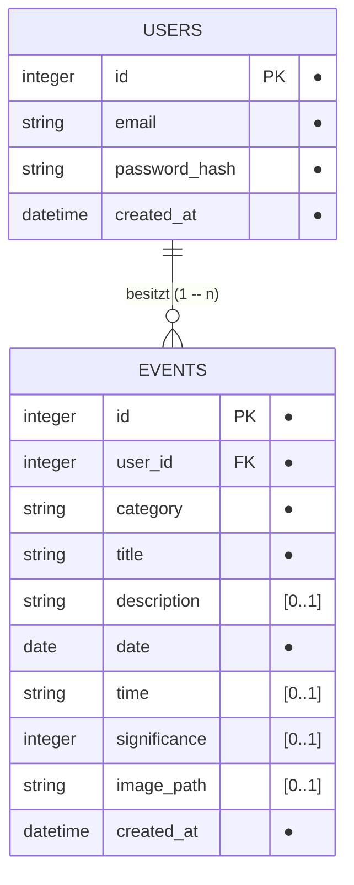

# D1 – Datenmodell

## D1.1 Übersicht

Das Datenmodell der Lifeline-Anwendung basiert auf den beiden zentralen Entitäten `USERS` und `EVENTS`.

Ein:e Nutzer:in kann mehrere Events besitzen. Jedes Event ist genau einem Nutzer bzw. einer Nutzerin zugeordnet.

Notation gemäß [D2.4](D2-datentypenverzeichnis.md#d24-notationskonventionen): `●` markiert Pflichtfelder, `[0..1]` optionale Attribute, `PK`/`FK` Primär- bzw. Fremdschlüssel.

## D1.2 Entität USERS

Die Entität `USERS` speichert die für Registrierung und Anmeldung benötigten Nutzerdaten.

| Attribut | Datentyp | Beschreibung |
|---|---|---|
| `id` | integer | Eindeutige ID des Nutzers (Primärschlüssel) |
| `email` | string | E-Mail-Adresse des Nutzers, eindeutig |
| `password_hash` | string | Gehashtes Passwort |
| `created_at` | datetime | Zeitpunkt der Erstellung des Benutzerkontos |

Das Passwort wird nicht im Klartext gespeichert, sondern ausschließlich als Hash.

## D1.3 Entität EVENTS

Die Entität `EVENTS` enthält die persönlichen Ereignisse der Nutzer:innen.

| Attribut | Datentyp | Beschreibung |
|---|---|---|
| `id` | integer | Eindeutige ID des Events (Primärschlüssel) |
| `user_id` | integer | Referenz auf den zugehörigen Nutzer (Fremdschlüssel) |
| `category` | string | Kategorie des Events (`meilenstein`, `karriere`, `bildung`, `beziehung`, `reise`, `gesundheit` oder `sonstiges`) |
| `title` | string | Titel des Events |
| `description` | string `[0..1]` | Beschreibung des Events |
| `date` | date | Datum des Events |
| `time` | string `[0..1]` | Uhrzeit des Events im Format `HH:MM` |
| `significance` | integer `[0..1]` | Bedeutung/Gewichtung des Events auf einer Skala von 0–100 (siehe [D2.2](D2-datentypenverzeichnis.md#d22-wertebereich-von-significance)); ohne Angabe wird im Frontend der Standardwert 50 angenommen |
| `image_path` | string `[0..1]` | Pfad zu einem optional hochgeladenen Bild des Events; die Bilddatei selbst liegt im Backend, nicht in der Datenbank (siehe [D2.3](D2-datentypenverzeichnis.md#d23-bild-image_path)) |
| `created_at` | datetime | Zeitpunkt der Erstellung |

> **Hinweis zur Kategorie als eigenständige Entität.** Aktuell ist `category` ein einfaches Attribut von `EVENTS` mit einem fest im Backend hinterlegten Wertebereich (sieben feste Kategorien). Eine eigene `CATEGORIES`-Entität, die Nutzer:innen eigene Kategorien anlegen ließe, ist **bewusst nicht** modelliert — das wäre laut Rückmeldung Prof. Lucke (siehe N1.3, Anforderung an echte Erweiterbarkeit) eine größere, noch offene Änderung, die Datenmodell, Backend und Frontend gleichermaßen betrifft, und keine reine Dokumentationskorrektur. Diese Entscheidung ist damit bewusst vertagt, nicht vergessen.

## D1.4 Beziehungen

Zwischen `USERS` und `EVENTS` besteht eine 1:n-Beziehung (`USERS 1 -- n EVENTS`).

Ein:e Nutzer:in kann mehrere Events besitzen. Ein Event gehört jedoch immer genau zu einem Nutzer bzw. einer Nutzerin. Die Zuordnung erfolgt über den Fremdschlüssel `user_id` in `EVENTS`.

## D1.5 Persistenz

Die persistente Speicherung der Daten erfolgt in einer SQLite-Datenbank. Das Backend übernimmt den Zugriff auf die Datenbank. Direkte Datenbankzugriffe durch das Frontend finden nicht statt.
