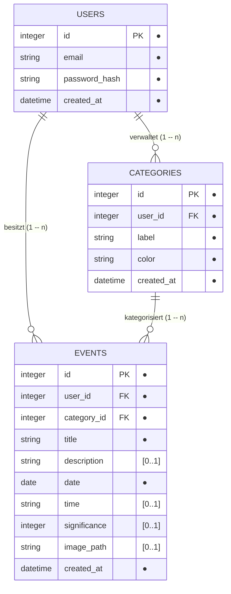

# D1 – Datenmodell

## D1.1 Übersicht

Das Datenmodell der Lifeline-Anwendung basiert auf drei zentralen Entitäten: `USERS`, `CATEGORIES` und `EVENTS`.

Ein:e Nutzer:in kann mehrere Kategorien und mehrere Events besitzen. Jede Kategorie gehört genau einem Nutzer bzw. einer Nutzerin. Jedes Event ist genau einem Nutzer bzw. einer Nutzerin und genau einer Kategorie zugeordnet.

Notation gemäß [D2.4](D2-datentypenverzeichnis.md#d24-notationskonventionen): `●` markiert Pflichtfelder, `[0..1]` optionale Attribute, `PK`/`FK` Primär- bzw. Fremdschlüssel.

## D1.2 USERS

Die Entität `USERS` speichert die für Registrierung und Anmeldung benötigten Nutzerdaten.

| Attribut | Datentyp | Beschreibung |
|---|---|---|
| `id` | integer | Eindeutige ID des Nutzers (Primärschlüssel) |
| `email` | string | E-Mail-Adresse des Nutzers, eindeutig |
| `password_hash` | string | Gehashtes Passwort |
| `created_at` | datetime | Zeitpunkt der Erstellung des Benutzerkontos |

Das Passwort wird nicht im Klartext gespeichert, sondern ausschließlich als Hash.

## D1.3 CATEGORIES

Die Entität `CATEGORIES` löst die frühere feste, im Code hinterlegte Kategorie-Werteliste ab (siehe N1, [NFR-14c-01 „Erweiterbarkeit der Kategorien"](N1-nichtfunktional.md#14-anforderungen-an-wartbarkeit)). Jede Person verwaltet ihre eigene Liste von Kategorien und kann über die Oberfläche jederzeit neue anlegen, ohne dass dafür Code geändert oder neu deployed werden muss.

| Attribut | Datentyp | Beschreibung |
|---|---|---|
| `id` | integer | Eindeutige ID der Kategorie (Primärschlüssel) |
| `user_id` | integer | Referenz auf den zugehörigen Nutzer (Fremdschlüssel) — Kategorien sind wie Events pro Person |
| `label` | string | Anzeigename der Kategorie, z. B. „Meilenstein" (pro Person eindeutig) |
| `color` | string | Hex-Farbcode für die Darstellung in Timeline und Filterleiste, z. B. `#38BDF8` |
| `created_at` | datetime | Zeitpunkt der Erstellung |

Jede neu registrierte Person erhält bei der Registrierung automatisch sechs vorbelegte Startkategorien (Meilenstein, Karriere, Bildung, Beziehung, Reise, Gesundheit) — das ist nur eine bequeme Vorbelegung, keine feste Liste: Sie lässt sich über `POST /api/categories` (siehe [UC-08](F2-anwendungsfaelle.md#uc-08--kategorie-anlegen)) beliebig um eigene Kategorien erweitern.

## D1.4 EVENTS

Die Entität `EVENTS` enthält die persönlichen Ereignisse der Nutzer:innen.

| Attribut | Datentyp | Beschreibung |
|---|---|---|
| `id` | integer | Eindeutige ID des Events (Primärschlüssel) |
| `user_id` | integer | Referenz auf den zugehörigen Nutzer (Fremdschlüssel) |
| `category_id` | integer | Referenz auf die zugehörige Kategorie (Fremdschlüssel auf [D1.3](#d13-categories)) |
| `title` | string | Titel des Events |
| `description` | string `[0..1]` | Beschreibung des Events |
| `date` | date | Datum des Events |
| `time` | string `[0..1]` | Uhrzeit des Events im Format `HH:MM` |
| `significance` | integer `[0..1]` | Bedeutung/Gewichtung des Events auf einer Skala von 0–100 (siehe [D2.2](D2-datentypenverzeichnis.md#d22-wertebereich-von-significance)); ohne Angabe wird im Frontend der Standardwert 50 angenommen |
| `image_path` | string `[0..1]` | Pfad zu einem optional hochgeladenen Bild des Events; die Bilddatei selbst liegt im Backend, nicht in der Datenbank (siehe [D2.3](D2-datentypenverzeichnis.md#d23-bild-image_path)) |
| `created_at` | datetime | Zeitpunkt der Erstellung |

## D1.5 Beziehungen

Zwischen `USERS` und `CATEGORIES` sowie zwischen `USERS` und `EVENTS` besteht je eine 1:n-Beziehung (`USERS 1 -- n CATEGORIES`, `USERS 1 -- n EVENTS`). Zwischen `CATEGORIES` und `EVENTS` besteht ebenfalls eine 1:n-Beziehung (`CATEGORIES 1 -- n EVENTS`).

Ein:e Nutzer:in kann mehrere Kategorien und mehrere Events besitzen; beide gehören jedoch immer genau zu einem Nutzer bzw. einer Nutzerin (Fremdschlüssel `user_id`). Jedes Event gehört außerdem genau zu einer Kategorie derselben Person (Fremdschlüssel `category_id` in `EVENTS`).

## D1.6 Persistenz

Die persistente Speicherung der Daten erfolgt in einer SQLite-Datenbank. Das Backend übernimmt den Zugriff auf die Datenbank. Direkte Datenbankzugriffe durch das Frontend finden nicht statt.

Bestehende Installationen mit der alten, fest codierten Kategorie-Liste (`EVENTS.category` als Text) werden beim Serverstart einmalig automatisch auf das hier beschriebene Modell umgestellt; bereits vorhandene Events bleiben dabei erhalten und werden der passenden neuen Kategorie-Zeile zugeordnet.
