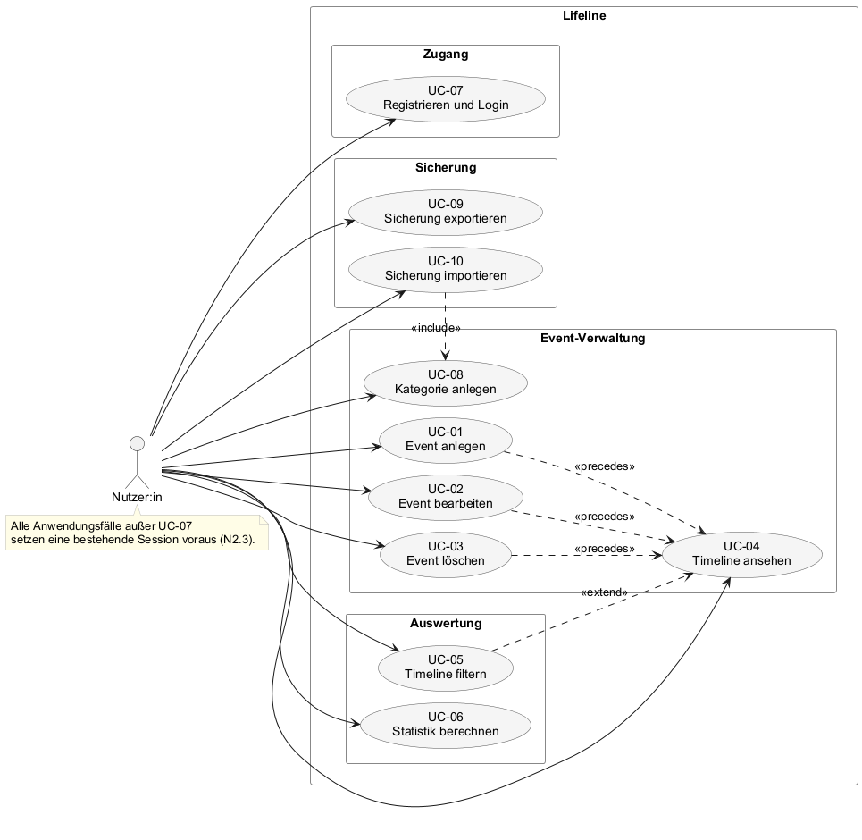

# F2 – Anwendungsfälle

Anwendungsfälle im Sinne von Siedersleben (Kap. 4.4): konkrete Interaktionsszenarien zwischen der Nutzer:in und Lifeline, die jeweils genau ein für die Nutzer:in bedeutsames Ziel verfolgen und in einem stabilen Endzustand münden. F2 ist die **systemgestützte Teilmenge** des in F1 beschriebenen Geschäftsprozesses: jeder Schritt aus F1, der eine Interaktion der Nutzer:in mit Lifeline umfasst, erscheint hier als Anwendungsfall; rein systeminterne Berechnungen (z. B. Statistik-Aggregation, Filterung) sind keine Anwendungsfälle – sie stehen als Anwendungsfunktionen in [F3](F3-anwendungsfunktionen.md).

Jeder Anwendungsfall wird mit derselben tabellarischen Vorlage beschrieben. Die Nummerierung ist stabil; ein einmal referenzierter UC wird nicht umnummeriert.

---

## F2.1 Anwendungsfall-Übersicht

| ID | Anwendungsfall | Gruppe | Bezug zu F1 |
|----|----------------|--------|-------------|
| [UC-07](#uc-07--registrieren-und-login) | Registrieren und Login | Zugang | F1.1 |
| [UC-01](#uc-01--event-anlegen) | Event anlegen | Event-Verwaltung | F1.2 |
| [UC-02](#uc-02--event-bearbeiten) | Event bearbeiten | Event-Verwaltung | F1.2 |
| [UC-03](#uc-03--event-löschen) | Event löschen | Event-Verwaltung | F1.2 |
| [UC-04](#uc-04--timeline-ansehen) | Timeline ansehen | Event-Verwaltung | F1.2 |
| [UC-05](#uc-05--timeline-filtern) | Timeline filtern | Auswertung | F1.3 |
| [UC-06](#uc-06--statistik-berechnen) | Statistik berechnen | Auswertung | F1.4 |

Das Diagramm zeigt die drei Gruppen von Anwendungsfällen: *Zugang* (UC-07, ohne bestehende Session erreichbar), *Event-Verwaltung* (UC-01 bis UC-04, das CRUD auf eigenen Events) und *Auswertung* (UC-05, UC-06, arbeiten auf den bereits geladenen bzw. gespeicherten Events). Die `<<precedes>>`-Beziehungen von UC-01 bis UC-03 zu UC-04 markieren, dass jede Änderung an einem Event zu einer aktualisierten Timeline-Darstellung führt; die `<<extend>>`-Beziehung von UC-04 zu UC-05 zeigt, dass Filterung eine optionale Erweiterung der Timeline-Ansicht ist. Die Randnotiz fasst zusammen, dass alle Anwendungsfälle außer UC-07 eine bestehende Session voraussetzen ([N2.3](N2-querschnittskonzepte.md#n23-authentifizierung-und-session)), statt dies als sechs wiederholte Kanten darzustellen.

---

## F2.2 Zugang

### UC-07 – Registrieren und Login

| Merkmal | Beschreibung |
|---|---|
| **Identifier** | UC-07 |
| **Name** | Registrieren und Login |
| **Akteur** | Nutzer:in |
| **Beschreibung** | Die Nutzer:in registriert sich oder meldet sich mit bestehenden Zugangsdaten an. |
| **Trigger** | Die Nutzer:in möchte sich registrieren oder anmelden. |
| **Vorbedingung** | Die Lifeline-Anwendung ist erreichbar. |
| **Nachbedingung** | Bei erfolgreicher Anmeldung erhält die Nutzer:in Zugriff auf die Anwendung. |

#### Hauptablauf – Registrierung

1. Die Nutzer:in öffnet das Registrierungsformular.
2. Die Nutzer:in gibt die erforderlichen Zugangsdaten ein.
3. Das Frontend übermittelt die Daten über den `ApiClient`.
4. Das Backend verarbeitet die Anfrage über `routes/auth`.
5. Die Zugangsdaten werden geprüft und der Nutzer wird gespeichert.
6. Die Registrierung wird bestätigt.

#### Hauptablauf – Login

1. Die Nutzer:in öffnet das Login-Formular.
2. Die Nutzer:in gibt E-Mail und Passwort ein.
3. Das Frontend übermittelt die Zugangsdaten über den `ApiClient`.
4. Das Backend verarbeitet die Anfrage über `routes/auth`.
5. Die Zugangsdaten werden geprüft.
6. Bei korrekten Zugangsdaten wird eine Session bereitgestellt (Session-Cookie).
7. Die Nutzer:in erhält Zugriff auf die Anwendung.

#### Ausnahmefälle

- Bei ungültigen Zugangsdaten wird die Anmeldung abgelehnt.
- Bei fehlenden oder ungültigen Eingaben wird eine Fehlermeldung angezeigt.
- Bei einer bereits vorhandenen Registrierung wird keine zweite Registrierung mit denselben Zugangsdaten angelegt.

---

## F2.3 Event-Verwaltung

### UC-01 – Event anlegen

| Merkmal | Beschreibung |
|---|---|
| **Identifier** | UC-01 |
| **Name** | Event anlegen |
| **Akteur** | Nutzer:in |
| **Beschreibung** | Die Nutzer:in legt ein neues Event an und fügt es der persönlichen Timeline hinzu. |
| **Trigger** | Die Nutzer:in möchte ein neues Event erstellen. |
| **Vorbedingung** | Authentifizierte Session (UC-07). |
| **Nachbedingung** | Das neue Event wurde erfolgreich gespeichert und erscheint in der Timeline. |

#### Hauptablauf

1. Die Nutzer:in öffnet das Formular zum Anlegen eines Events.
2. Die Nutzer:in gibt die erforderlichen Informationen ein.
3. Die Nutzer:in sendet das Formular ab.
4. Das Frontend übermittelt die Daten über den `ApiClient` an das Backend.
5. Die Eingaben werden durch die Validierung geprüft.
6. Das Backend verarbeitet die Anfrage über `routes/events`.
7. Das Event wird in der Datenbank gespeichert.
8. Das Backend meldet den erfolgreichen Vorgang zurück.
9. Die Timeline wird aktualisiert (UC-04).

#### Ausnahmefälle

- Sind erforderliche Eingaben ungültig, wird das Event nicht gespeichert.
- Das Frontend zeigt der Nutzer:in eine Fehlermeldung an.

---

### UC-02 – Event bearbeiten

| Merkmal | Beschreibung |
|---|---|
| **Identifier** | UC-02 |
| **Name** | Event bearbeiten |
| **Akteur** | Nutzer:in |
| **Beschreibung** | Die Nutzer:in verändert die Informationen eines bestehenden Events. |
| **Trigger** | Die Nutzer:in möchte ein bestehendes Event ändern. |
| **Vorbedingung** | Authentifizierte Session; das zu bearbeitende Event existiert und gehört der Nutzer:in. |
| **Nachbedingung** | Die Änderungen wurden gespeichert und werden in der Timeline angezeigt. |

#### Hauptablauf

1. Die Nutzer:in wählt ein bestehendes Event aus (UC-04).
2. Die Nutzer:in öffnet die Bearbeitungsfunktion.
3. Das Event-Formular wird mit den vorhandenen Daten angezeigt.
4. Die Nutzer:in verändert die gewünschten Angaben.
5. Die Nutzer:in speichert die Änderungen.
6. Das Frontend übermittelt die geänderten Daten über den `ApiClient`.
7. Das Backend validiert die Eingaben.
8. Das Event wird aktualisiert.
9. Die aktualisierten Daten werden in der Timeline angezeigt (UC-04).

#### Ausnahmefälle

- Sind die eingegebenen Daten ungültig, werden die Änderungen nicht gespeichert.
- Die Nutzer:in erhält eine Fehlermeldung.

---

### UC-03 – Event löschen

| Merkmal | Beschreibung |
|---|---|
| **Identifier** | UC-03 |
| **Name** | Event löschen |
| **Akteur** | Nutzer:in |
| **Beschreibung** | Die Nutzer:in entfernt ein bestehendes Event aus der Timeline. |
| **Trigger** | Die Nutzer:in möchte ein Event löschen. |
| **Vorbedingung** | Authentifizierte Session; das Event existiert und gehört der Nutzer:in. |
| **Nachbedingung** | Das Event wurde aus der Datenbank und der Timeline entfernt. |

#### Hauptablauf

1. Die Nutzer:in wählt ein bestehendes Event aus (UC-04).
2. Die Nutzer:in wählt die Funktion zum Löschen.
3. Das Frontend sendet die Löschanfrage über den `ApiClient`.
4. Das Backend verarbeitet die Anfrage über `routes/events`.
5. Das entsprechende Event wird aus der Datenbank entfernt.
6. Das Backend bestätigt den erfolgreichen Vorgang.
7. Die Timeline wird aktualisiert (UC-04).

#### Ausnahmefälle

- Kann das Event nicht gefunden werden, wird die Löschung nicht durchgeführt.
- Die Nutzer:in erhält eine entsprechende Fehlermeldung.

---

### UC-04 – Timeline ansehen

| Merkmal | Beschreibung |
|---|---|
| **Identifier** | UC-04 |
| **Name** | Timeline ansehen |
| **Akteur** | Nutzer:in |
| **Beschreibung** | Die Nutzer:in betrachtet die vorhandenen Events in chronologischer Darstellung. |
| **Trigger** | Die Nutzer:in öffnet die Timeline. |
| **Vorbedingung** | Authentifizierte Session. |
| **Nachbedingung** | Die vorhandenen Events werden in der Timeline dargestellt. |

#### Hauptablauf

1. Die Nutzer:in öffnet die Timeline.
2. Das Frontend fordert die vorhandenen Events an.
3. Der `ApiClient` kommuniziert mit dem Backend.
4. Das Backend stellt die vorhandenen Events bereit.
5. Das Frontend stellt die Events chronologisch in der Timeline dar.

#### Alternativabläufe

- Die Nutzer:in filtert die dargestellten Events (UC-05).
- Die Nutzer:in wählt ein Event zur Bearbeitung oder Löschung aus (UC-02, UC-03).

#### Ausnahmefälle

- Sind keine Events vorhanden, wird eine leere Timeline angezeigt.
- Bei einem Fehler beim Laden der Daten erhält die Nutzer:in eine Fehlermeldung.

---

## F2.4 Auswertung

### UC-05 – Timeline filtern

| Merkmal | Beschreibung |
|---|---|
| **Identifier** | UC-05 |
| **Name** | Timeline filtern |
| **Akteur** | Nutzer:in |
| **Beschreibung** | Die Nutzer:in filtert die bereits geladenen Events nach einer Kategorie. |
| **Trigger** | Die Nutzer:in möchte nur Events einer bestimmten Kategorie sehen. |
| **Vorbedingung** | Events wurden bereits geladen und werden in der Timeline angezeigt (UC-04). |
| **Nachbedingung** | Die Timeline zeigt nur die zur Auswahl passenden Events. |

#### Hauptablauf

1. Die Nutzer:in öffnet die Filterfunktion.
2. Die Nutzer:in wählt eine Kategorie aus.
3. Die bereits geladenen Events werden anhand der ausgewählten Kategorie gefiltert ([F3.AF-03](F3-anwendungsfunktionen.md#af-03--timeline-filterung)).
4. Die Timeline wird mit den gefilterten Events aktualisiert.

#### Ausnahmefälle

- Gibt es keine passenden Events, wird eine entsprechend leere Darstellung angezeigt.
- Die Nutzer:in kann den Filter entfernen und wieder alle Events anzeigen.

---

### UC-06 – Statistik berechnen

| Merkmal | Beschreibung |
|---|---|
| **Identifier** | UC-06 |
| **Name** | Statistik berechnen |
| **Akteur** | Nutzer:in |
| **Beschreibung** | Die Nutzer:in lässt eine aggregierte Statistik auf Basis der vorhandenen Events erstellen. |
| **Trigger** | Die Nutzer:in öffnet die Statistikansicht. |
| **Vorbedingung** | Authentifizierte Session. |
| **Nachbedingung** | Die berechnete Statistik wird in der Statistikansicht dargestellt. |

#### Hauptablauf

1. Die Nutzer:in öffnet das `StatsDashboard`.
2. Das Frontend fordert die Statistikdaten über den `ApiClient` an.
3. Die Anfrage wird an `routes/stats` weitergeleitet.
4. Der `statsService` berechnet die aggregierten Werte ([F3.AF-01](F3-anwendungsfunktionen.md#af-01--ereignisdauer-berechnen), [F3.AF-02](F3-anwendungsfunktionen.md#af-02--statistik-aggregation)).
5. Die benötigten Event-Daten werden über die Models aus der SQLite-Datenbank geladen.
6. Die berechneten Statistikdaten werden an das Frontend zurückgegeben.
7. Das `StatsDashboard` stellt die Statistik dar.

#### Ausnahmefälle

- Sind keine auswertbaren Events vorhanden, wird eine neutrale Statistik (0-Werte) angezeigt, kein Fehler.
- Bei einem Fehler beim Abrufen oder Berechnen der Daten wird eine Fehlermeldung angezeigt.

---

## F2.5 Nicht Teil von F2

- **Statistik-Aggregation und Filter-Berechnung selbst.** Systeminterne Algorithmen ohne eigenen Entscheidungspunkt der Nutzer:in – siehe [F3](F3-anwendungsfunktionen.md).
- **Eingabevalidierung.** Querschnittskonzept – siehe [N2.2](N2-querschnittskonzepte.md#n22-validierung).
- **Persistenz.** Implementierung, nicht Spezifikation.

## F2.6 Querverweise

| Baustein | Bezug zu F2 |
|---|---|
| [F1](F1-geschaeftsprozesse.md) | F1.1 bis F1.4 werden durch UC-07, UC-01–UC-04 bzw. UC-05, UC-06 realisiert. |
| [F3](F3-anwendungsfunktionen.md) | AF-01, AF-02 werden von UC-06 genutzt; AF-03 von UC-05. |
| [D1](D1-datenmodell.md) | `USERS` und `EVENTS` werden von allen UCs gelesen bzw. geschrieben; UC-03 ist der einzige, der löscht. |
| [B1](B1-dialogspezifikation.md) | Bildschirmgestaltung und Dialogablauf je UC. |
| [N1](N1-nichtfunktional.md) | NFA-01 (Benutzbarkeit UC-01), NFA-02 (Validierung UC-01/UC-02), NFA-05 (Performance UC-04). |
| [N2](N2-querschnittskonzepte.md) | N2.3 *Authentifizierung und Session* setzt jeden UC außer UC-07 voraus. |
