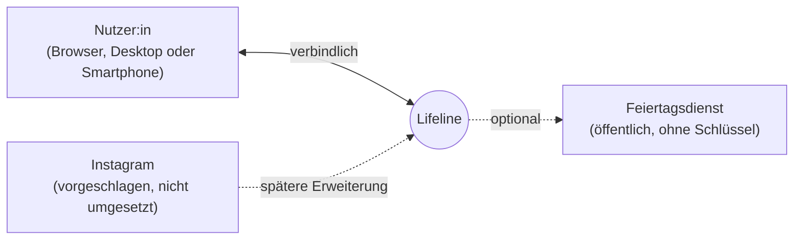

# P2 – Architekturüberblick

## 1. Zweck

P2 gibt einen groben Überblick darüber, aus welchen Teilen Lifeline besteht,
mit welchen Nachbarsystemen es zusammenarbeitet und wie ein typischer Ablauf
aussieht. Er dient als Orientierung für alle weiteren Bausteine der
Spezifikation. Die ausführliche, technische Beschreibung mit Komponenten,
Abläufen, Verteilung und Architekturentscheidungen steht in
[`docs/arch/`](../arch/) (arc42).

## 2. Systemüberblick

Lifeline ist eine browserbasierte Webanwendung. Nutzer:innen erfassen
persönliche Ereignisse mit Datum, Kategorie und Bedeutung und sehen sie in
einer interaktiven, chronologischen Timeline.

Die Anwendung gliedert sich in vier Bestandteile:

1. **Oberfläche (Frontend)** für Darstellung und Bedienung im Browser,
2. **Anwendungslogik (Backend)** für Anmeldung, Prüfung der Eingaben,
   Zugriffsschutz und Auswertung,
3. **Datenbank** für die dauerhafte Speicherung von Konten, Kategorien und Events,
4. **Bildablage** für die zu Events hochgeladenen Bilder.

Datenbank und Bildablage werden ausschließlich über die Anwendungslogik
angesprochen, nie direkt aus dem Browser.

## 3. Systemkontext und Nachbarsysteme



Vollständiges Inventar der Nachbarsysteme; die Schnittstellen sind in
[S1](S1-nachbarsysteme.md) spezifiziert:

| ID | Nachbarsystem | Art | Status |
|---|---|---|---|
| NB-01 | Browser der Nutzer:in | Verbindlich: einziger Zugangskanal | Umgesetzt |
| NB-02 | Feiertagsdienst | Optional: Anzeige gesetzlicher Feiertage; ein Ausfall stört die Timeline nicht | Umgesetzt |
| NB-03 | Instagram | Vorgeschlagene Erweiterung: Übernahme eigener Beiträge als Events | Nicht umgesetzt ([OP-07](../OFFENE-PUNKTE.md)) |

Externe Anmeldedienste, Kalender und Benachrichtigungsdienste sind bewusst
nicht angebunden ([NG-04](P1-ziele-rahmenbedingungen.md#p142-nichtziele),
[NG-05](P1-ziele-rahmenbedingungen.md#p142-nichtziele)).

## 4. Hauptbestandteile

### 4.1 Oberfläche

Die Oberfläche zeigt die Timeline (Übersicht über alle Jahre und
Jahresansicht mit Feiertagen), die Event-Karten, das Formular zum Anlegen und
Bearbeiten, die Filterleiste mit dem Anlegen eigener Kategorien und die
Statistik. Filtern, PNG-Export und das Erzeugen bzw. Einlesen einer
Sicherungsdatei laufen vollständig im Browser. Die Dialoge sind in
[B1](B1-dialogspezifikation.md) beschrieben.

### 4.2 Anwendungslogik

Die Anwendungslogik stellt eine HTTP-Schnittstelle bereit und übernimmt:

- Registrierung, Anmeldung und Abmeldung mit Session,
- Anlegen, Lesen, Ändern und Löschen der eigenen Events und Kategorien,
- verbindliche Prüfung aller Eingaben ([N2.2](N2-querschnittskonzepte.md#n22-validierung)),
- Zugriffsschutz: jede Person erreicht nur ihre eigenen Daten
  ([NFR-15a-01](N1-nichtfunktional.md)),
- Speichern und Ausliefern der Bilder,
- Berechnung der Statistik ([AF-02](F3-anwendungsfunktionen.md)),
- Vermittlung des Feiertagsdienstes (NB-02).

### 4.3 Datenbank und Bildablage

Gespeichert werden Benutzerkonten, Kategorien und Events; das vollständige
Datenmodell steht in [D1](D1-datenmodell.md), die fachlichen Wertebereiche in
[D2](D2-datentypenverzeichnis.md). Bilder liegen als Dateien in der
Bildablage, die Datenbank enthält nur den Verweis. Beide zusammen bilden den
Datenbestand, der jede Auslieferung überdauern muss
([S3.3](../betrieb/S3-inbetriebnahme.md)).

## 5. Zusammenspiel der Bestandteile

Typischer Ablauf am Beispiel „Event anlegen“ ([UC-01](F2-anwendungsfaelle.md#uc-01--event-anlegen)):

1. Die Nutzer:in füllt im Browser das Formular aus und speichert.
2. Die Oberfläche sendet die Eingaben an die Anwendungslogik.
3. Die Anwendungslogik prüft Session, Eingaben und Kategorie.
4. Ist ein Bild dabei, wird es geprüft und in der Bildablage gespeichert.
5. Das Event wird in der Datenbank gespeichert und zurückgemeldet.
6. Die Oberfläche aktualisiert Timeline und Statistik.

Parallel zum Laden der Timeline fragt die Oberfläche die Feiertage des
angezeigten Jahres an. Diese Anfrage ist unabhängig: Die Timeline wird nie auf
sie warten ([S1.3.2](S1-nachbarsysteme.md#s132-bindende-regel-fehlerverhalten)).

Die technischen Abläufe sind in [A06](../arch/A06-Laufzeitansicht.md) als
Sequenzdiagramme beschrieben.

## 6. Projekt- und Codeorganisation

Oberfläche und Anwendungslogik liegen getrennt, aber im selben Repository:

```text
lifeline-project/
├── frontend/          Oberfläche (React, TypeScript, Vite, Tailwind CSS)
├── backend/           Anwendungslogik (Node.js, TypeScript, Express, SQLite)
├── docs/
│   ├── spec/          Spezifikation nach Siedersleben
│   ├── arch/          Architektur nach arc42
│   └── betrieb/       Inbetriebnahme (S3)
└── README.md          Einrichtung, Start, Tests
```

## 7. Sicherheit und Datenschutz

Lifeline speichert persönliche Lebensereignisse
([CON-3j-01](P1-constraints.md#con-3j-01-persönliche-daten)). Daraus folgen:

- verbindliche Prüfung aller Eingaben in der Anwendungslogik,
- Zugriff auf Datenbank und Bildablage ausschließlich über die Anwendungslogik,
- Zugriff jeder Person nur auf ihre eigenen Daten, auch bei direkter Adressierung,
- Speicherung von Passwörtern nur als Hash,
- Datensparsamkeit: nur die fachlich nötigen Angaben (E-Mail, Passwort, Events),
- kein direkter Kontakt des Browsers zu Drittanbietern; auch Schriften werden
  von Lifeline selbst ausgeliefert.

Die messbaren Anforderungen stehen in [N1](N1-nichtfunktional.md) §15, die
Umsetzung in [A08](../arch/A08-Querschnittskonzepte.md).

## 8. Technologiestack

| Bereich | Technologie |
|---|---|
| Oberfläche | React, TypeScript, Vite, Tailwind CSS |
| Anwendungslogik | Node.js (ab 22.13), TypeScript, Express |
| Datenbank | SQLite, eingebettet im Backend-Prozess |
| Versionsverwaltung | Git und GitHub |

Die Begründungen der Technologiewahl stehen in den ADRs in
[A09](../arch/A09-Architekturentscheidungen.md).
