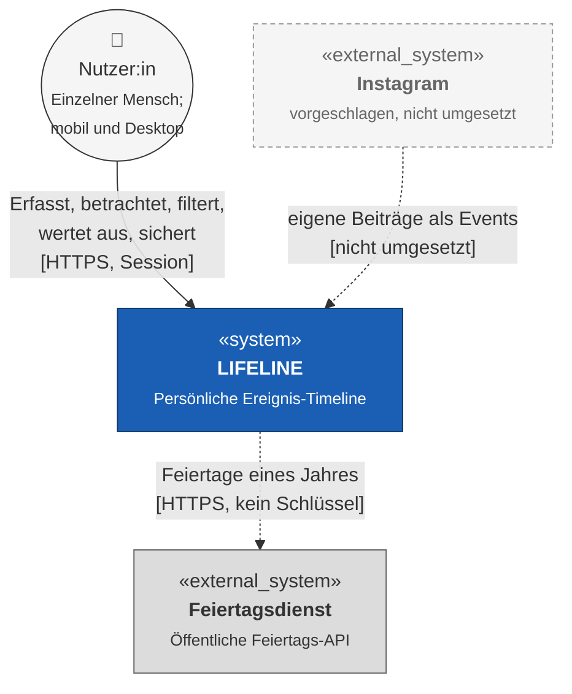

# S1 — Nachbarsystem-Schnittstellen

S1 beschreibt alle Systeme außerhalb von Lifeline, mit denen Lifeline Daten austauscht,
und legt für jede Schnittstelle fest, welche Operationen es gibt und wie sich Lifeline bei
Fehlern verhält.

**Übersicht und Umsetzungsstand:**

| ID | Nachbarsystem | Art | Umgesetzt |
|---|---|---|:--:|
| [NB-01](#s12-nb-01--browser-der-nutzerin) | Browser der Nutzer:in | Verbindlich, einziger Zugangskanal | ja |
| [NB-02](#s13-nb-02--feiertagsdienst) | Feiertagsdienst (öffentliche Feiertags-API) | Optional, nicht-blockierend | ja |
| [NB-03](#s14-nb-03--instagram-vorgeschlagene-erweiterung) | Instagram | Vorgeschlagene Erweiterung | nein ([OP-07](../OFFENE-PUNKTE.md)) |

Die durchgezogene Kante zu Lifeline ist verbindlich, die gestrichelte zum Feiertagsdienst
optional — genau diese Unterscheidung ist der Kern der Fehlersemantik in S1.3. Die
gestrichelte, grau umrandete Kante von Instagram kennzeichnet eine beschriebene, aber nicht
umgesetzte Erweiterung.

Das Kontextdiagramm ist eine Ebene gröber als das S1-Inventar. Die Zuordnung zu den
S1-Abschnitten ist:

- **Nutzer:in** + der eingehende HTTPS-Kanal → [S1.2](#s12-nb-01--browser-der-nutzerin)
  (die Person ist der Akteur, der Browser der Kanal, gegen den S1 einen Vertrag
  schließt).
- **Feiertagsdienst** → [S1.3](#s13-nb-02--feiertagsdienst).
- **Instagram** → [S1.4](#s14-nb-03--instagram-vorgeschlagene-erweiterung).

---

## S1.1 Konventionen

Die folgenden Konventionen gelten für jede unten aufgeführte Operation:

- **Synchron für NB-01, nicht-blockierend für NB-02.** Jeder Aufruf gegenüber
  `NB-01` ist Teil einer einzelnen HTTP-Anfrage und blockiert deren Antwort.
  Der Aufruf von `NB-02` erfolgt nicht-blockierend und darf niemals eine
  Anfrage der Nutzer:in zum Scheitern bringen. Es gibt keine Warteschlange,
  keinen Hintergrundarbeiter und keine zeitgesteuerte Wiederholung
  ([CON-3b-02](P1-constraints.md#con-3b-02-kein-scheduler-kein-hintergrundprozess)).
- **Fehlerfortpflanzung.** Fehler gegenüber `NB-01` werden in die Klassen aus
  [N2.4](N2-querschnittskonzepte.md#n24-fehlerbehandlung) eingeordnet und in der
  Oberfläche nach [B1.4.2](B1-dialogspezifikation.md#b142-fehlermeldungen) dargestellt.
  Fehler gegenüber `NB-02` folgen der Sonderregel in S1.3 und erreichen die Oberfläche
  überhaupt nicht.
- **Authentifizierung.** Zugriffe über `NB-01` sind sitzungsgebunden
  ([N2.3](N2-querschnittskonzepte.md#n23-authentifizierung-und-session)). `NB-02`
  erfordert keinen Schlüssel; Geheimnisse werden ohnehin nie im Repository oder Protokoll
  geführt ([N2.5](N2-querschnittskonzepte.md#n25-secret-handling-und-protokollierung)).
- **Details auf Payload-Ebene.** Konkrete Endpunkt-URLs, Feldnamen, Statuscodes und
  Wiederholungsbudgets sind Implementierungssache und leben in
  [`docs/arch/`](../arch/) und im Code, nicht hier. S1 legt fest, **welche** Operationen
  es gibt und **welche Semantik** sie haben; die Architekturschicht bindet das an
  konkrete Endpunkte.

---

## S1.2 NB-01 — Browser der Nutzer:in

Der Browser ist der einzige menschliche Zugangskanal zu Lifeline. Die Dialogoberfläche
ist in [B1](B1-dialogspezifikation.md) spezifiziert, die einzelnen Operationen
(Registrieren, Anmelden und Abmelden, Event anlegen/ändern/löschen, Kategorie anlegen,
Auswertung abrufen, Sicherung exportieren und importieren) in
[F2](F2-anwendungsfaelle.md). Über das hinaus, was B1 und F2 bereits festlegen, ist hier
kein weiterer Protokollvertrag zu spezifizieren.

Was S1 an dieser Grenze ergänzt, ist die grenzüberschreitende Semantik, die B1 und F2
nicht von sich aus zeigen:

### S1.2.1 Grenzsemantik

| Aspekt | Festlegung |
|---|---|
| Verbindlichkeit | Jede Antwort ist verbindlich — im Unterschied zu `NB-02`. |
| Fehlende Session | Abweisung; die Oberfläche leitet nach [B1.4.1](B1-dialogspezifikation.md#b141-umleitung-ohne-session) zum Zugangsformular. |
| Zugriff auf fremde Daten | Abweisung, **ohne** zu unterscheiden, ob das Objekt nicht existiert oder einer anderen Nutzer:in gehört ([NFR-15a-01](N1-nichtfunktional.md)). |
| Teilzustände | Ausgeschlossen; eine fehlgeschlagene Operation hinterlässt keinen halb gespeicherten Datensatz ([NFR-12d-02](N1-nichtfunktional.md)). |
| Vertrauensgrenze | Alles, was über `NB-01` hereinkommt, gilt als nicht vertrauenswürdig, auch von einer angemeldeten Nutzer:in ([N2.2](N2-querschnittskonzepte.md#n22-validierung)). |

---

## S1.3 NB-02 — Feiertagsdienst

Speicherfreie Anreicherung der Timeline mit gesetzlichen Feiertagen.

**Umsetzungsstand:** umgesetzt. Die Jahresansicht der Timeline zeigt die Feiertage des
gewählten Jahres; technisch vermittelt das Backend den Dienst (A03, A05, A06 Kapitel 6.4,
ADR-008).

### S1.3.1 Warum dieses Nachbarsystem

Von den in `docs/OFFENE-PUNKTE.md` (OP-04) geprüften Kandidaten ist der Feiertagsdienst
der einzige, der zu [CON-3g-01](P1-constraints.md#con-3g-01-kein-budget-für-infrastruktur)
(kein Budget) und [CON-3h-01](P1-constraints.md#con-3h-01-harte-abgabefrist)
(Abgabefrist) passt: kein Schlüssel, keine Registrierung, kein Ausfallrisiko, das die
Kernfunktion gefährdet.

Fachlicher Nutzen: Feiertage werden als dezente Markierungen im Hintergrund der Timeline
angezeigt und helfen, eigene Events zeitlich einzuordnen. Das ist eine **Erweiterung**,
keine Muss-Funktion (umgesetzt ist sie dennoch); sie ändert nichts an
[P1.4.1](P1-ziele-rahmenbedingungen.md#p141-zuordnung-der-anwendungsfälle).

| Aspekt | Inhalt |
|---|---|
| **Operation** | `getHolidays(country, year) → [{ date, name }]` |
| **Richtung** | Ausgehend (Anfrage: Ländercode + Jahr; Antwort: Liste von Feiertagen). |
| **Eingaben** | Fester Ländercode aus der Hostkonfiguration, Standard: Deutschland (`DE`); das in der Timeline sichtbare Kalenderjahr (1900 bis 2100, siehe [B1](B1-dialogspezifikation.md#dlg-01--timeline); andere Werte weist das Backend ab, ohne den Dienst aufzurufen). Kein Schlüssel erforderlich (siehe S1.1). |
| **Ausgaben** | Liste aus Datum und Bezeichnung, eingeblendet als Hintergrundmarkierung in [DLG-01](B1-dialogspezifikation.md#dlg-01--timeline). Wird **nicht** persistiert — kein Attribut in [D1](D1-datenmodell.md) wird davon befüllt. |
| **Ausgelöst durch** | [UC-04](F2-anwendungsfaelle.md#uc-04--timeline-ansehen), Schritt 4, sowie jeder Wechsel des Jahres in der Jahresansicht. |
| **Semantik** | Rein informativ; keine Rückwirkung auf `EVENTS` oder `CATEGORIES`. Das Ergebnis wird je Land und Jahr zwischengespeichert, solange die Anwendung läuft, um wiederholte Aufrufe zu vermeiden; nach einem Neustart wird es bei Bedarf neu abgefragt. |
| **Fehlerbehandlung** | Nicht erreichbar, langsame Antwort, ungültige Daten und unbekanntes Jahr/Land werden **alle** wie „keine Feiertage für diesen Zeitraum" behandelt. Es entsteht keine Fehlermeldung an die Nutzer:in. |
| **Verantwortung** | Der externe Dienst wird vom jeweiligen externen Anbieter betrieben; Lifeline übernimmt keine administrative Verantwortung. |
| **Anpassungen am Nachbarsystem** | Keine Anpassungen erforderlich; Lifeline nutzt den öffentlich bereitgestellten Dienst ausschließlich über dessen vorhandene Schnittstelle. |

### S1.3.2 Bindende Regel (Fehlerverhalten)

Dies ist das erste Nachbarsystem in Lifeline, dessen Ausfall **kein Fehler der
Nutzer:in** sein darf.

> Kein Zustand in [UC-04](F2-anwendungsfaelle.md#uc-04--timeline-ansehen) darf vom
> Erfolg dieses Aufrufs abhängen. Die Timeline wird angezeigt, sobald die eigenen Events
> geladen sind — der Aufruf an `NB-02` wird nicht abgewartet und sein Scheitern nicht
> gemeldet. Feiertage erscheinen nachträglich, sobald die Antwort da ist, oder gar nicht.

Damit unterscheidet sich `NB-02` grundsätzlich von `NB-01`: bei `NB-01` ist jede Antwort
verbindlich, bei `NB-02` ist ihr Fehlen ein regulärer, erwarteter Fall.

---

## S1.4 NB-03 — Instagram (vorgeschlagene Erweiterung)

Import eigener Instagram-Beiträge als Lifeline-Ereignisse.

**Umsetzungsstand:** nicht umgesetzt. Dieser Abschnitt beschreibt eine mögliche spätere
Ausbaustufe; siehe [OP-07](../OFFENE-PUNKTE.md).

### S1.4.1 Abgrenzung für die Abgabe

Instagram wurde als mögliches weiteres Nachbarsystem vorgeschlagen. Eine echte
Anbindung über die Instagram Graph API ist für die aktuelle Abgabe nicht Bestandteil
des verbindlichen Funktionsumfangs: Sie benötigt eine Meta-App, OAuth-Berechtigungen,
ein geeignetes Instagram-Konto und gegebenenfalls eine Prüfung durch Meta.

Als erste Ausbaustufe wäre ein manueller Import eines vorher festgelegten
Instagram-Exportformats denkbar; auch dieser ist nicht umgesetzt. Ein Importdatensatz enthält mindestens eine
Instagram-Medien-ID, eine Caption, ein Veröffentlichungsdatum und optional ein Bild.
Lifeline wandelt jeden gültigen Datensatz in ein eigenes Event um und speichert das
Bild mit derselben Bildpersistenz wie manuell erfasste Events. Die Medien-ID verhindert
doppelte Importe; dafür müsste `EVENTS` in [D1](D1-datenmodell.md#d14-events) um ein
optionales Attribut für die Herkunft (Instagram-Medien-ID, je Person eindeutig) erweitert
werden. Das heutige Datenmodell enthält dieses Attribut nicht.

| Aspekt | Festlegung |
|---|---|
| Richtung | Eingehend: Instagram bzw. Exportdatei → Lifeline |
| Auslösung | Manuell durch die Nutzer:in; kein Scheduler und keine automatische Synchronisation |
| Persistenz | Importierte Beiträge werden als normale Lifeline-Events gespeichert; Bilder liegen unter `backend/uploads/`, in SQLite steht nur der Pfad |
| Authentifizierung | Für einen manuellen Import wäre keine Instagram-Anmeldung nötig; eine echte API-Anbindung erfordert OAuth |
| Fehlerbehandlung | Ungültige Datensätze werden abgewiesen; bereits importierte Medien werden übersprungen |
| Status | Vorgeschlagene Erweiterung, **nicht umgesetzt** |

### S1.4.2 Spätere echte Anbindung

Eine spätere Produktivversion kann den manuellen Import durch OAuth und die Instagram
Graph API ersetzen. Sie darf nur Medien des vom jeweiligen Konto autorisierten
Instagram-Profils importieren. Die extern gelieferte Medien-URL sollte nicht als
dauerhafte Lifeline-Datenhaltung verwendet werden; das Bild muss beim Import in die
eigene Ablage übernommen werden.

Wie beim Feiertagsdienst spricht nur das Backend mit Instagram, nie der Browser
direkt ([P2](P2-architekturüberblick.md) Abschnitt 7, ADR-008 in
[A09](../arch/A09-Architekturentscheidungen.md)). Anders als NB-02 bräuchte diese
Anbindung Geheimnisse: das App-Secret der Meta-App und die Zugriffstoken der
Nutzer:innen. Sie liegen ausschließlich im Backend, das App-Secret als
Umgebungsvariable, und werden nie protokolliert
([N2.5](N2-querschnittskonzepte.md#n25-secret-handling-und-protokollierung)).

## S1.5 Nicht Teil von S1

- **Interner Ablauf innerhalb von Lifeline.** Wie Anwendungslogik und Datenhaltung
  zusammenspielen, ist keine Nachbarsysteminteraktion — siehe
  [F2](F2-anwendungsfaelle.md) und [A05](../arch/A05-Bausteinansicht.md).
- **Domänenalgorithmen laufen innerhalb von Lifeline.** AF-01 bis AF-05 arbeiten auf
  bereits vorhandenen, eigenen Daten; sie sind keine Nachbarsysteminteraktion — siehe
  [F3](F3-anwendungsfunktionen.md).
- **Endpunkt-URLs, Feldnamen, Codec-Details, Wiederholungsbudgets.**
  Implementierungssache — siehe [`docs/arch/`](../arch/).
- **Die Dialogoberfläche der Nutzer:in.** Spezifiziert in
  [B1](B1-dialogspezifikation.md).
- **Die Betriebsumgebung.** Stellt Laufzeit und Speicher bereit, ist aber kein
  Kommunikationspartner — siehe [`docs/betrieb/S3`](../betrieb/S3-inbetriebnahme.md).
- **Sicherung exportieren und importieren (UC-09, UC-10).** Die Sicherungsdatei stammt aus
  Lifeline selbst und wird über den Browser (NB-01) hoch- bzw. heruntergeladen; es ist kein
  weiteres Nachbarsystem beteiligt.
- **Datenmigration.** Baustein S2, nicht anwendbar.

---

## S1.6 Referenzen auf S1

Anders als eine gewöhnliche Querverweistabelle zeigt diese Tabelle die Richtung **von den
anderen Bausteinen auf S1**: was dort konkret aus S1 aufgerufen oder vorausgesetzt wird.

| Baustein | Bezug zu S1 |
|---|---|
| **F2** | UC-04 Schritt 4 ruft S1.3 auf. Alle übrigen Anwendungsfälle, einschließlich des Imports der eigenen Sicherung (UC-10), laufen ausschließlich über S1.2. Ein Instagram-Import wäre ein neuer Anwendungsfall für S1.4. |
| **F3** | Kein Bezug. AF-01 bis AF-05 verarbeiten nur bereits geladene, eigene Daten; das Ergebnis von S1.3 fließt in keine Anwendungsfunktion ein. |
| **D1** | Kein Attribut wird durch S1 befüllt. Feiertage aus S1.3 werden ausdrücklich **nicht** gespeichert — das ist eine bewusste Festlegung, keine Lücke. |
| **B1** | DLG-01 zeigt das Ergebnis von S1.3 als Hintergrundmarkierung. Kein Dialog stellt einen Fehler dar, wenn S1.3 ausfällt (B1.4.2 ist hier bewusst nicht angewendet). |
| **N1** | `NFR-15a-01` und `NFR-15b-01` gelten für S1.2. Für S1.3 gilt sinngemäß, dass ihr Ausfall keine Anforderung an S1.2 verletzen darf. |
| **N2** | N2.2 Validierung gilt an der Grenze zu S1.2; N2.4 Fehlerbehandlung enthält die für S1.3 geltende Sonderregel; N2.5 Secret-Handling und Protokollierung gilt für S1.2 — S1.3 braucht keine Geheimnisse; eine spätere Anbindung nach S1.4.2 bräuchte welche und fiele ebenfalls unter N2.5. |
| **P2** | P2 Abschnitt 3 führt NB-01 bis NB-03 als vollständiges Nachbarsysteminventar. |
| **`docs/OFFENE-PUNKTE.md`** | OP-04 wird durch S1.3 gelöst; OP-07 hält fest, dass S1.4 nicht umgesetzt ist. |
